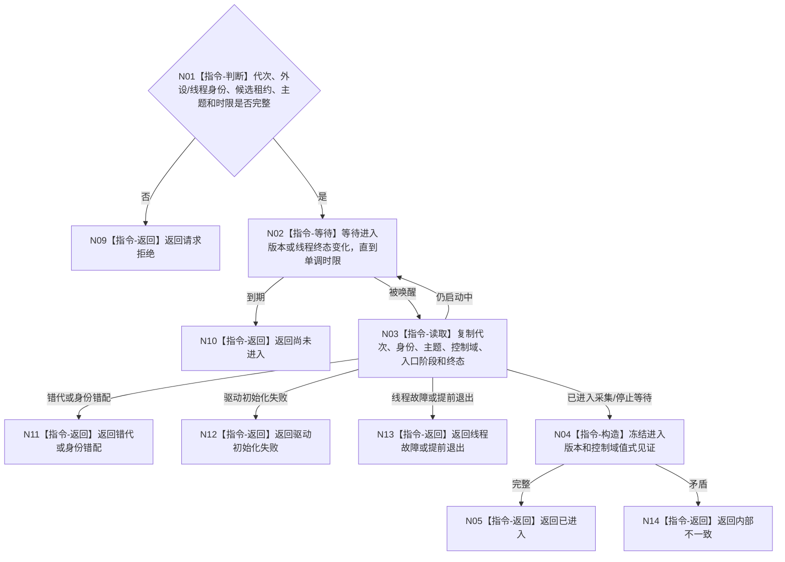

# BIZ-L4-001-07-01-03 等待外设线程进入采集等待态目标函数流程图 v0.1

更新时间：2026-08-27

## 依据

```text
8110、8120；BIZ-L3-001-07-01；BIZ-L1-T06
```

## 身份与边界

正式目标函数设计图。等待一个外设线程候选完成入口装配并进入可响应采集时机或停止请求的等待态；不要求已经采集或发布任何报告。

## 函数合同

```text
根函数：等待外设线程进入采集等待态
归属模块 / 文件 / 目标分解深度：外设线程启动协调 / 海中鱼巣/启动.线程组协调.ixx / BIZ-L4
现有或待新增：目标等待函数和内部版本化进入见证未实现；发布源码模拟线程只有可轮询bool原子量
完整签名：外设线程进入等待结果 等待外设线程进入采集等待态(const 外设线程进入等待请求& 请求) noexcept
参数：请求为只读借用；含运行代次、外设与逻辑线程身份、候选租约、预期主题合同、单调时限和停止令牌；租约覆盖等待
返回结果：调用方拥有的不可变值式结果；含已进入、尚未进入、错代、身份错配、驱动初始化失败、线程故障、线程提前退出或内部不一致，以及进入版本和控制域见证
被调函数流程图：无独立被调项目函数；条件变量等待、伪唤醒循环和单调时限是本函数内平台指令
父图：BIZ-L3-001-07-01
```

## 流程图



## 节点合同

| 节点 | 类型 | 输入 | 输出 | 事实读写 | 验证 |
| --- | --- | --- | --- | --- | --- |
| N02/N03 | 指令 | 候选租约和时限 | 当前候选副本 | 只读候选状态 | 伪唤醒、错代、初始化失败和提前退出 |
| N04/N05 | 指令 | 一致进入材料 | 不可变进入见证 | 无 | 进入版本和控制域身份完整 |

## 关键边界

进入见证只证明本候选已完成入口依赖绑定、持有指定独占控制域并能响应采集时机或停止生产门；不证明已采集、驱动质量、报告形成、6340承接或世界事实提交成功。8110生命周期投影不是本函数成功谓词。

## 冻结发布源码对照（提交 `79985857`）

- 发布源码不存在本函数、等待请求/结果、条件变量、进入版本、控制域见证或主题/代次逐字段复核。
- 模拟外设采样材料线程在lambda入口把`已进入`置true，但调用方没有有界等待函数；其线程随后只忙等停止，且文件规则禁止接D455。
- D455采集器有同步`打开()`结果和状态快照，但没有物理外设线程入口或“采集/停止等待态”内部见证；打开成功不能替代本图进入成功。
