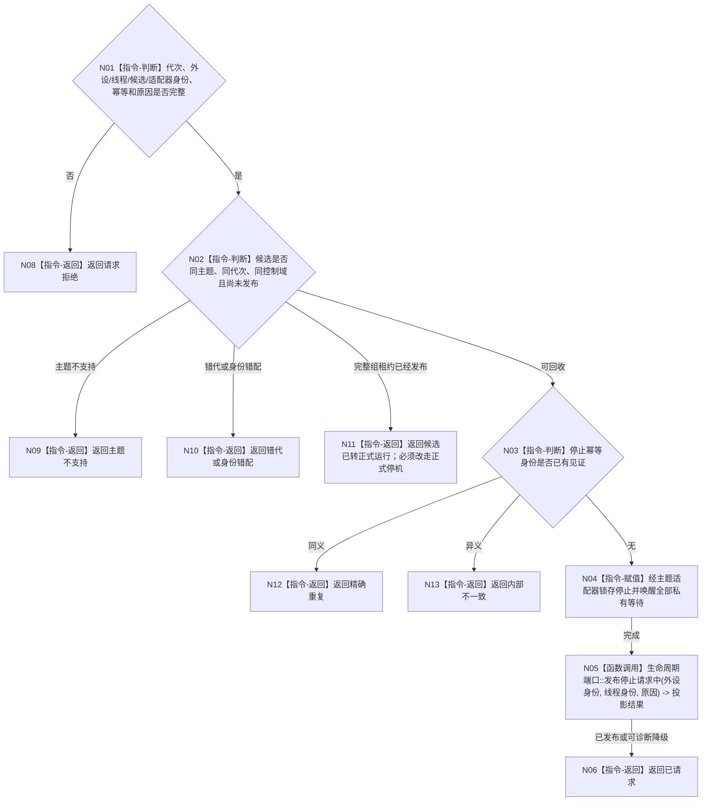

# BIZ-L4-001-07-02-01 停止一个外设线程启动候选目标函数流程图 v0.1

更新时间：2026-08-27

## 依据

```text
6340、8110、8120；BIZ-L3-001-07-02
```

## 身份与边界

正式目标函数设计图。为一个尚未发布的外设控制域候选锁存停止并唤醒驱动、采集和报告发布等待；不连接线程、不关闭正式控制域，也不删除报告。

## 函数合同

```text
根函数：停止一个外设线程启动候选
归属模块 / 文件 / 目标分解深度：外设线程启动协调 / 海中鱼巣/启动.线程组协调.ixx / BIZ-L4
现有或待新增：目标停止函数、DTO和幂等见证未实现；具体D455采集器已有停止资源动作但无候选合同
完整签名：外设线程候选停止结果 停止一个外设线程启动候选(const 外设线程候选停止请求& 请求) noexcept
参数：请求为只读借用；含运行代次、外设稳定身份、线程逻辑身份、候选租约身份、主题适配器身份、停止幂等身份和启动回收原因；调用方继续持有候选租约，停止见证不取得材料舍弃权
返回结果：不可变值式结果；含已请求、精确重复、请求拒绝、错代、身份错配、主题不支持、候选已发布或内部不一致，以及停止见证
被调函数流程图：无；主题适配器停止锁存、唤醒和8110旁路发布属于本函数内协调指令
父图：BIZ-L3-001-07-02
```

## 流程图



## 节点合同

| 节点 | 类型 | 参数 / 输入绑定 | 结果 / 输出绑定 | 事实读写 | 后继条件 | 验证 |
| --- | --- | --- | --- | --- | --- | --- |
| N02/N03 | 指令-判断 | 候选、主题和幂等身份 | 停止资格 | 只读控制域状态 | 未发布且同义 | 错主题、错代和重复停止 |
| N04 | 指令-赋值 | 停止请求 | 停止见证 | 只改控制域运行状态 | 原子锁存 | 驱动、采集和报告等待均唤醒 |
| N05 | 函数调用 | 生命周期材料 | 投影结果 | 只写8110旁路 | 可诊断降级 | 投影失败不撤回停止 |

## 关键边界

外设主题适配器只能实现启动配置中已启用主题的停止合同，不能以通用 `void*` 或无类型函数指针猜测控制域类型。停止必须先关闭新采集生产门，再唤醒采集、发布重试和线程等待；候选完整组租约已发布后必须使用正式外设停机链。

## 当前代码对应（HEAD `79985857`）

- HEAD不存在本目标自由函数、候选/适配器稳定身份、停止幂等、启动回收原因或8110停止请求投影。
- D455采集器`请求停止()`/析构能锁存停止并关闭RealSense管线；模拟线程`请求停止并发送停止消息()`能置原子停止位，但两者都没有候选阶段、完整组发布状态、唯一在途槽或材料守恒判断。
- 因此当前停止动作只能作为主题适配器内部机械候选，不能证明本图的同义重放、身份复核和“只停生产、不舍弃材料”合同。
