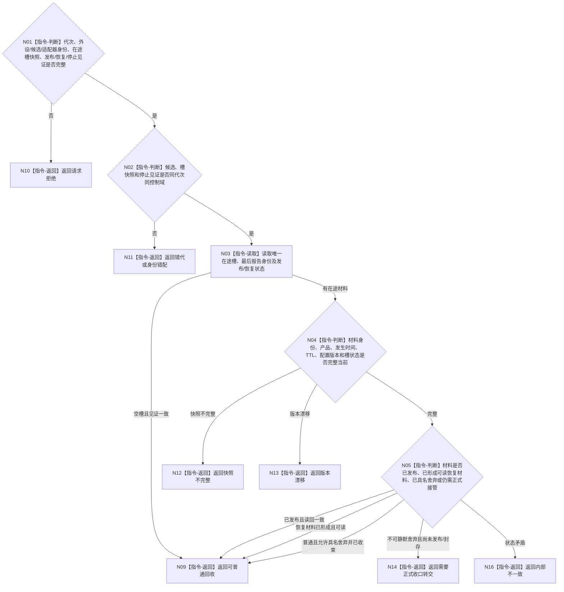

# BIZ-L4-001-07-02-02 复核候选未产生待承接不可舍弃材料目标函数流程图 v0.1

更新时间：2026-08-27

## 依据

```text
6320、6340；BIZ-L3-001-07-02
```

## 身份与边界

正式目标函数设计图。停止锁存后只读复核一个外设启动候选的唯一在途槽、最后报告发布见证和恢复材料见证，判断能否普通连接，还是必须把不可舍弃在途材料连同唯一租约转正式收口；不消费、不舍弃、不复制报告。已经进入6340物理队列的报告不阻止线程连接，也不得回退为候选材料。

## 函数合同

```text
根函数：复核候选未产生待承接不可舍弃材料
归属模块 / 文件 / 目标分解深度：外设线程启动协调 / 海中鱼巣/启动.线程组协调.ixx / BIZ-L4
现有或待新增：目标复核函数、唯一在途槽快照和发布/恢复见证均未实现
完整签名：外设候选材料复核结果 复核候选未产生待承接不可舍弃材料(const 外设候选材料复核请求& 请求)
参数：请求为只读借用；含运行代次、外设稳定身份、候选租约身份、主题适配器身份、唯一在途槽只读快照、最后报告身份/发布见证、恢复材料见证和停止见证；视图只在调用期间有效
返回结果：不可变值式结果；含可普通回收、需要正式收口转交、请求拒绝、错代、身份错配、快照不完整、版本漂移或内部不一致，以及不可舍弃在途材料身份和既有发布/恢复见证
被调函数流程图：无；唯一槽读取、分类及发布/恢复一致性复核为本函数内只读指令
父图：BIZ-L3-001-07-02
```

## 流程图



## 节点合同

| 节点 | 类型 | 参数 / 输入绑定 | 结果 / 输出绑定 | 事实读写 | 后继条件 | 验证 |
| --- | --- | --- | --- | --- | --- | --- |
| N02 | 指令-判断 | 候选、槽快照和停止见证 | 读取资格 | 无 | 同控制域 | 错代与快照替换 |
| N03/N04 | 指令 | 唯一在途槽和发布/恢复见证 | 当前槽材料 | 只读，不出队 | 完整当前 | 槽唯一性、版本和稳定身份 |
| N05 | 指令-判断 | 材料分类、发布与恢复状态 | 普通回收许可或正式转交 | 无 | 6340强类型分类 | 已发布、已恢复、合法舍弃与不可舍弃缺口 |

## 关键边界

只读快照不能代替报告材料本体，也不能把报告升级为世界事实。发现尚未发布/封存的不可舍弃在途材料时返回转交要求，由BIZ-L2-001-13正式停产/恢复链连同唯一租约处理，而不是由启动协调器消费。已经发布到6340队列的报告保持独立生命周期，本函数不等待其承接。

## 冻结发布源码对照（提交 `79985857`）

- HEAD没有通用T06唯一在途槽、强类型外设报告、报告稳定身份、6340物理队列发布见证或不可舍弃恢复材料owner，因此不存在本目标复核入口。
- D455缓存有进程内候选/已发布材料状态，但它只承载同步帧材料，不是6350四产品/6340强类型报告队列，也没有跨重启不可舍弃恢复权威。
- 模拟外设采样材料线程只含旧标量队列且没有在途槽或报告分类，不能用队列为空证明本目标“可普通回收”。
