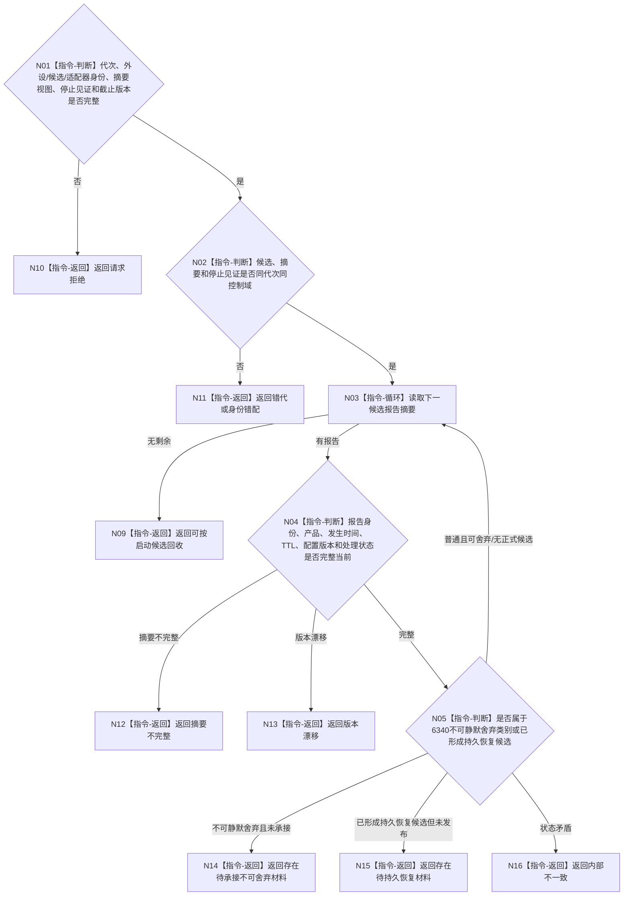

# BIZ-L4-001-07-02-02 复核候选未产生待承接不可舍弃材料目标函数流程图 v0.1

更新时间：2026-08-03

## 依据

```text
6320、6340；BIZ-L3-001-07-02
```

## 身份与边界

正式目标函数设计图。只读复核一个外设启动候选在停止前是否已经生成必须持久恢复或正式承接的报告；不消费、不舍弃、不复制报告。

## 函数合同

```text
根函数：复核候选未产生待承接不可舍弃材料
归属模块 / 文件 / 层级：外设线程启动协调 / 海中鱼巣/启动.线程组协调.ixx / L4
现有或待新增：待新增；消费具体主题适配器提供的只读候选报告摘要
完整签名：外设候选材料复核结果 复核候选未产生待承接不可舍弃材料(const 外设候选材料复核请求& 请求)
参数：请求为只读借用；含运行代次、外设稳定身份、候选租约身份、主题适配器身份、候选报告摘要视图、停止见证和事实截止版本；视图只在调用期间有效
返回结果：不可变值式结果；含可按启动候选回收、存在待承接不可舍弃材料、存在待持久恢复材料、请求拒绝、错代、身份错配、摘要不完整、版本漂移或内部不一致，以及具名报告身份组
被调函数流程图：无；候选摘要枚举、分类和一致性复核为本函数内只读指令
父图：BIZ-L3-001-07-02
```

## 流程图



## 节点合同

| 节点 | 类型 | 参数 / 输入绑定 | 结果 / 输出绑定 | 事实读写 | 后继条件 | 验证 |
| --- | --- | --- | --- | --- | --- | --- |
| N02 | 指令-判断 | 候选、摘要和停止见证 | 读取资格 | 无 | 同控制域 | 错代与摘要替换 |
| N03/N04 | 指令 | 候选摘要 | 当前报告摘要 | 只读，不出队 | 完整当前 | 截止版本和稳定身份 |
| N05 | 指令-判断 | 报告分类和治理状态 | 回收许可或阻断 | 无 | 6340强类型分类 | 安全事件、状态跃迁、丢失、错误和缺口 |

## 关键边界

只读摘要不能代替报告材料本体，也不能把报告升级为世界事实。发现不可舍弃材料时返回阻断，由正式6340承接/恢复链处理，而不是由启动协调器消费。

