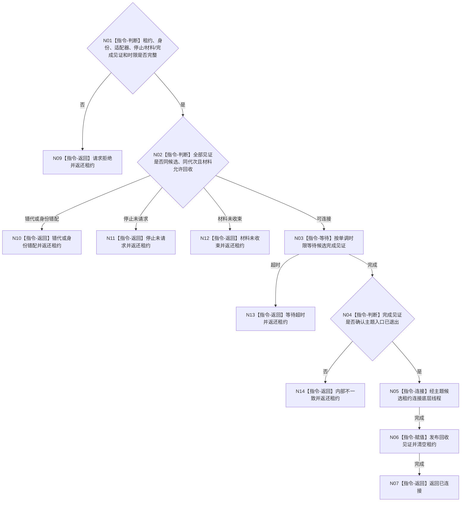

# BIZ-L4-001-07-02-03 连接一个外设线程候选目标函数流程图 v0.1

更新时间：2026-08-03

## 依据

```text
6340、8110、8120；BIZ-L3-001-07-02
```

## 身份与边界

正式目标函数设计图。只在候选已停止、完成见证成立且材料复核允许回收时连接底层线程；不消费报告、不关闭已发布控制域。

## 函数合同

```text
根函数：连接一个外设线程候选
归属模块 / 文件 / 层级：外设线程启动协调 / 海中鱼巣/启动.线程组协调.ixx / L4
现有或待新增：待新增；由具体主题候选租约提供统一join能力并补齐时限和返还
完整签名：外设线程候选连接结果 连接一个外设线程候选(外设线程候选租约&& 候选租约, const 外设线程候选连接请求& 请求) noexcept
参数：候选租约为唯一移动所有权；请求为只读借用，含运行代次、外设稳定身份、线程逻辑身份、主题适配器身份、停止见证、材料复核见证、完成见证和非零单调最长等待
返回结果：移动值式结果；含已连接、请求拒绝、错代、身份错配、停止未请求、材料未收束、等待超时或内部不一致；未连接时返还唯一候选租约
被调函数流程图：无；等待完成、主题适配器join和回收见证为本函数内指令
父图：BIZ-L3-001-07-02
```

## 流程图



## 节点合同

| 节点 | 类型 | 参数 / 输入绑定 | 结果 / 输出绑定 | 事实读写 | 后继条件 | 验证 |
| --- | --- | --- | --- | --- | --- | --- |
| N02 | 指令-判断 | 三类见证和候选租约 | 连接资格 | 只读 | 同候选且材料可回收 | 不可舍弃报告阻断 |
| N03/N04 | 指令 | 完成见证和时限 | 完成或超时 | 无 | 主题入口已退出 | 伪唤醒和错主题 |
| N05/N06 | 指令 | 唯一候选租约 | 连接和回收见证 | 释放线程/驱动资源 | 只连接一次 | 双join、detach和租约丢失 |

## 关键边界

材料复核允许回收只适用于未发布启动候选；正式运行控制域必须先停止新采集、收束不可舍弃报告并完成6340承接/恢复治理后再连接。

