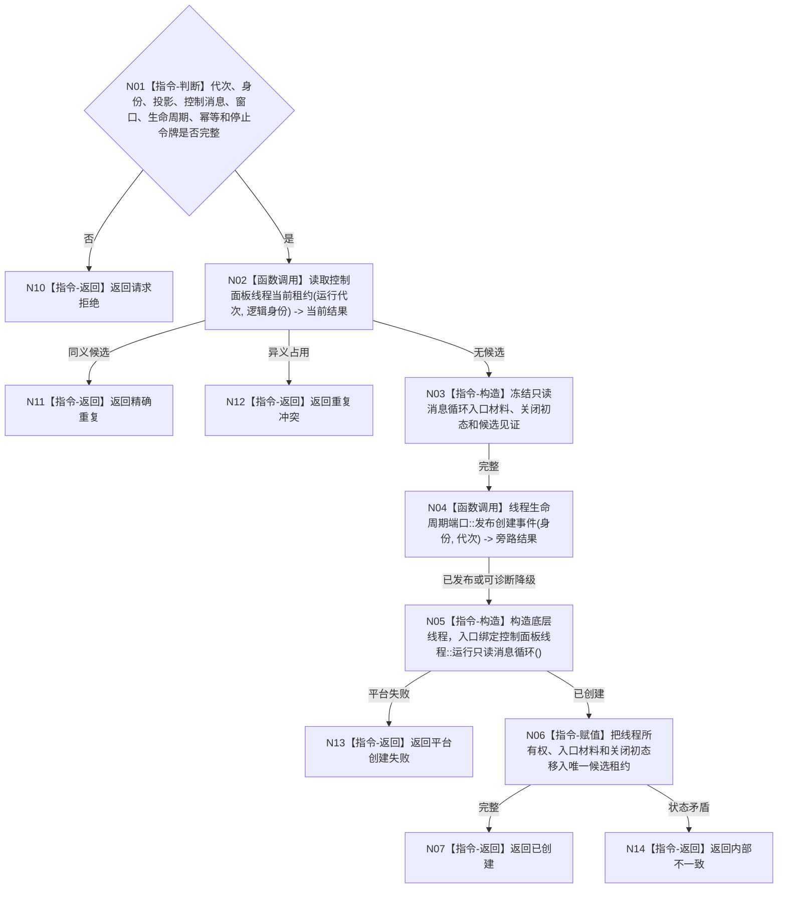

# BIZ-L4-001-09-01-01 创建控制面板线程候选目标函数流程图 v0.1

更新时间：2026-08-03

## 依据

```text
4050、8110、8120；BIZ-L3-001-09-01；BIZ-L1-T05 v0.3
```

## 身份与边界

正式目标函数设计图。只创建一个绑定运行代次、逻辑身份和只读端口的控制面板线程候选；候选入口固定为控制面板线程的只读消息循环，不因线程创建、窗口出现或页面显示生成业务事实。

## 函数合同

```text
根函数：创建控制面板线程候选
归属模块 / 文件 / 层级：控制面板线程 / 海中鱼巣/线程/控制面板线程.ixx / L4
现有或待新增：待新增；复用BIZ-L1-T05 v0.3运行只读消息循环目标和现有窗口端口设计
完整签名：控制面板线程候选创建结果 创建控制面板线程候选(const 控制面板线程候选创建请求& 请求)
参数：请求为只读借用；含运行代次、唯一逻辑身份、只读投影端口、程序控制消息桥、窗口端口、线程生命周期端口、启动幂等身份和停止令牌；全部借用覆盖候选租约
返回结果：移动值式结果；含已创建、请求拒绝、精确重复、重复冲突、平台创建失败或内部不一致，以及唯一控制面板线程候选租约
被调函数流程图：BIZ-L1-T05 v0.3 控制面板线程::运行只读消息循环；8110生命周期投影只作诊断旁路
父图：BIZ-L3-001-09-01
```

## 流程图



## 节点合同

| 节点 | 类型 | 参数 / 输入绑定 | 结果 / 输出绑定 | 事实读写 | 后继条件 | 验证 |
| --- | --- | --- | --- | --- | --- | --- |
| N01/N02 | 指令 / 函数调用 | 代次、身份和全部端口 | 候选资格 | 只读线程投影 | 无异义占用 | 错代、重复和端口缺失 |
| N04 | 函数调用 | 生命周期材料 | 旁路结果 | 只写8110消息 | 允许诊断降级 | 消息失败不改变候选语义 |
| N05/N06 | 指令 | 独占入口材料 | 唯一移动租约 | 只改线程资源 | 平台创建成功 | 禁止detach、复制租约和主线程运行窗口循环 |

## 关键边界

候选创建不等待窗口进入，也不把窗口句柄作为跨线程业务身份。进入消息循环由BIZ-L3-001-09-02独立读取见证；启动失败回收由BIZ-L3-001-09-03完成。
