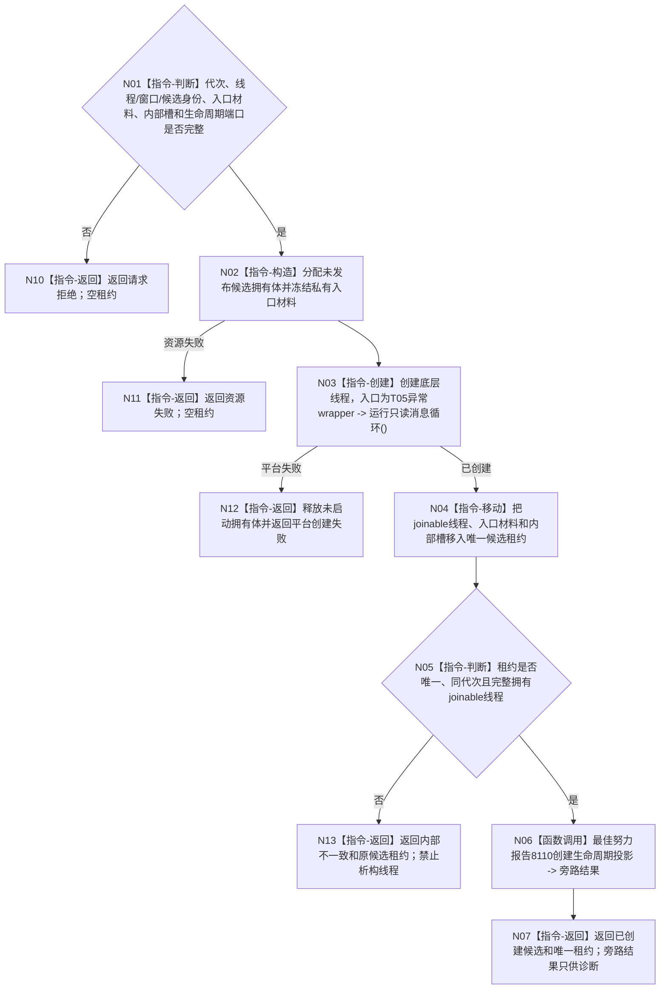

# BIZ-L4-001-09-01-01 创建控制面板线程候选目标函数流程图 v0.1

更新时间：2026-08-27

## 依据

```text
0050、4050、8110 v0.3、8120 v0.10；BIZ-L3-001-09-01；BIZ-L1-T05 v0.4
```

## 身份与边界

正式目标函数设计图。只创建一个绑定运行代次、逻辑身份和只读端口的T05物理线程候选。候选私有入口固定调用控制面板线程只读消息循环；8110创建事件只能在底层线程真实创建后最佳努力发布，不参与候选所有权或成功裁决。

## 函数合同

```text
根函数：创建控制面板线程候选
归属模块 / 文件 / 目标分解深度：控制面板线程 / 海中鱼巣/线程/控制面板线程.ixx / BIZ-L4
现有或待新增：待新增；HEAD无T05模块、窗口/UI实现或程序控制消息桥
完整签名：控制面板线程候选创建结果 创建控制面板线程候选(const 控制面板线程候选创建请求& 请求) noexcept
参数：请求为只读借用；含运行代次、唯一逻辑线程/窗口/候选身份、只读消息循环入口材料、线程生命周期发布端口和内部启动/终止槽；全部借用覆盖候选租约
返回结果：移动值式结果；底层线程未创建时为空租约；一旦创建成功，无论8110发布或后置互证结果如何都返还唯一候选租约；状态分账已创建、请求拒绝、平台创建失败、资源失败和内部不一致
被调函数流程图：候选私有入口调用BIZ-L1-T05 v0.4 控制面板线程::运行只读消息循环；创建者直接复用BIZ-L3-004-15-01 v0.2唯一线程生命周期发布provider，不调用只负责创建后T05变化的BIZ-L2-005-02
父图：BIZ-L3-001-09-01
```

## 流程图



## 节点合同

| 节点 | 类型 | 参数 / 输入绑定 | 结果 / 输出绑定 | 事实读写 | 后继条件 | 验证 |
| --- | --- | --- | --- | --- | --- | --- |
| N01—N03 | 判断 / 构造 / 创建 | 完整入口请求 | 0..1底层线程 | 只分配本地资源 | 平台线程成功才存在候选 | 缺端口、资源/平台失败、线程快速运行 |
| N04—N05 | 移动 / 判断 | 已创建底层线程 | 唯一候选租约 | 只改本地所有权 | joinable线程必被租约持有 | 结果包装失败和异常安全 |
| N06—N07 | 函数调用 / 返回 | 已发生创建事件 | 旁路投影结果及候选 | 只写唯一8110 provider | 旁路任意状态都不丢候选 | provider不可用、容量满、冲突 |

## 关键边界

创建事件必须晚于物理线程创建，不能预报尚未发生的生命周期。创建者按8110负责创建事件；BIZ-L2-005-02只报告创建后的T05真实变化，不能被本函数挪作创建适配。候选创建不等待窗口进入，也不把窗口句柄、8110投影或页面显示当跨线程身份；进入由BIZ-L3-001-09-02读取内部见证，失败由BIZ-L3-001-09-03持有同一唯一租约收口。
