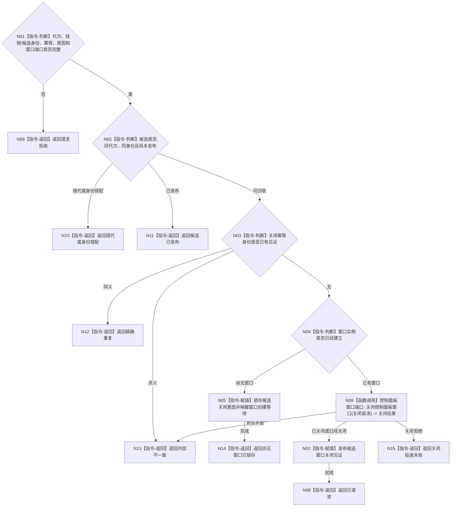

# BIZ-L4-001-09-03-01 请求关闭控制面板线程候选窗口目标函数流程图 v0.1

更新时间：2026-08-03

## 依据

```text
8110、8120；BIZ-L3-001-09-03；BIZ-L2-005-06；当前控制面板窗口运行能力
```

## 身份与边界

正式目标函数设计图。只向一个未发布控制面板线程候选拥有的窗口实例投递关闭请求；窗口尚未创建时锁存关闭意图，使后续创建过程立即收束。它不连接线程，也不表示普通宿主已经停止。

## 函数合同

```text
根函数：请求关闭控制面板线程候选窗口
归属模块 / 文件 / 层级：控制面板线程 / 海中鱼巣/线程/控制面板线程.ixx / L4
现有或待新增：待新增；复用BIZ-L2-005-06窗口关闭能力，补齐候选阶段、无窗口锁存和幂等见证
完整签名：控制面板候选窗口关闭结果 请求关闭控制面板线程候选窗口(const 控制面板候选窗口关闭请求& 请求) noexcept
参数：请求为只读借用；含运行代次、线程逻辑身份、候选租约身份、可选窗口实例身份、关闭幂等身份、关闭原因和窗口端口；调用方继续持有候选租约
返回结果：不可变值式结果；含已请求、精确重复、尚无窗口已锁存、请求拒绝、错代、身份错配、候选已发布、关闭投递失败或内部不一致，以及关闭见证
被调函数流程图：BIZ-L2-005-06 控制面板窗口端口::关闭控制面板窗口；尚无窗口分支只锁存候选关闭意图
父图：BIZ-L3-001-09-03
```

## 流程图



## 节点合同

| 节点 | 类型 | 参数 / 输入绑定 | 结果 / 输出绑定 | 事实读写 | 后继条件 | 验证 |
| --- | --- | --- | --- | --- | --- | --- |
| N02/N03 | 指令-判断 | 候选阶段和幂等身份 | 关闭资格 | 只读线程候选状态 | 未发布且同义 | 已发布必须转正式停机 |
| N04/N05 | 指令 | 可选窗口身份 | 关闭意图见证 | 只改候选运行状态 | 窗口尚未建立 | 创建中失败和竞态 |
| N06 | 函数调用 | 当前窗口实例和关闭原因 | 结构化关闭结果 | 只操作UI资源 | 已关闭或具名非成功 | 重复关闭、实例替换 |

## 关键边界

窗口关闭只收束UI候选，不生成程序停止、任务完成、需求满足或业务事实。窗口关闭能力必须在线程亲和边界内执行，跨线程调用由窗口端口投递而不是直接销毁句柄。
