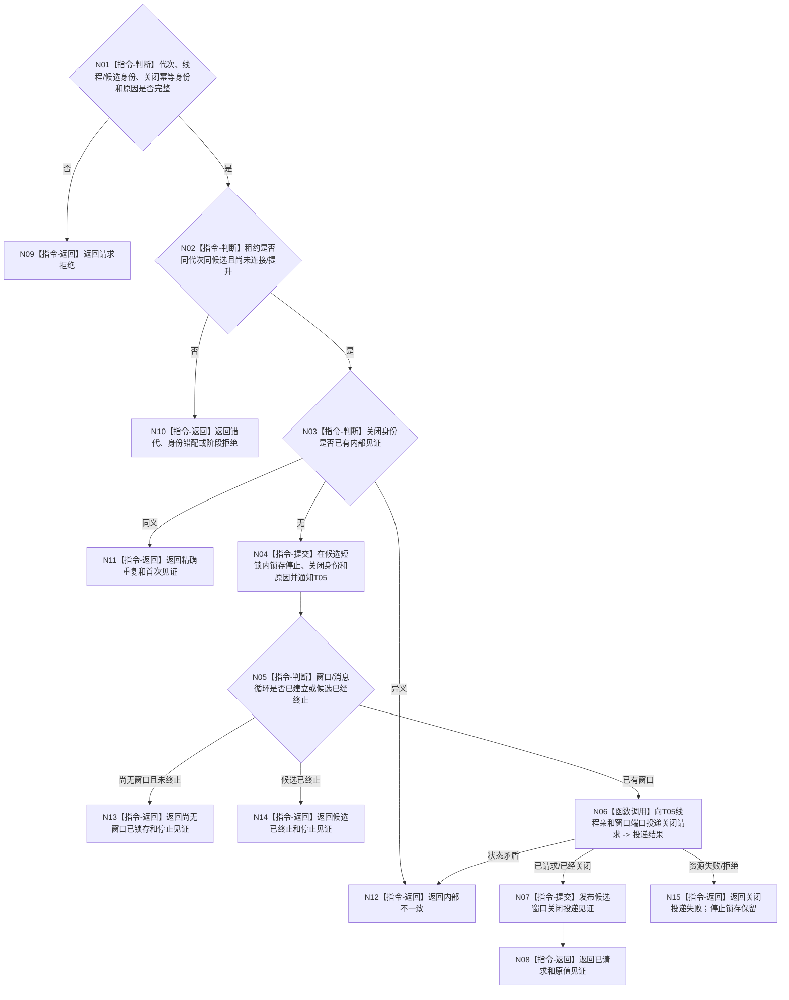

# BIZ-L4-001-09-03-01 请求关闭控制面板线程候选窗口目标函数流程图 v0.1

更新时间：2026-08-27

## 依据

```text
0050、8110 v0.3、8120 v0.10；BIZ-L3-001-09-03；BIZ-L2-005-06 v0.2
```

## 身份与边界

正式目标函数设计图。只对一个未提升为正式T05租约的候选锁存停止，并在线程亲和边界内请求关闭其窗口。窗口尚未建立时，停止锁存使后继创建路径不进入正常消息循环；窗口已经建立时，只向T05投递关闭，不从T01线程直接销毁平台句柄。

## 函数合同

```text
根函数：请求关闭控制面板线程候选窗口
归属模块 / 文件 / 目标分解深度：控制面板线程 / 海中鱼巣/线程/控制面板线程.ixx / BIZ-L4
现有或待新增：待新增；HEAD无T05候选、窗口端口或线程亲和关闭投递
完整签名：控制面板候选窗口关闭结果 请求关闭控制面板线程候选窗口(const 控制面板候选窗口关闭请求& 请求) noexcept
参数：请求为只读借用；含运行代次、线程/候选身份、关闭幂等身份和关闭原因；调用方继续持有唯一候选租约，窗口端口已由租约冻结
返回结果：不可变值式结果；含已请求、精确重复、尚无窗口已锁存、候选已终止、请求拒绝、错代、身份错配、关闭投递失败或内部不一致，以及候选停止/关闭见证
被调函数流程图：已有窗口时经线程亲和适配复用BIZ-L2-005-06 v0.2；尚无窗口只写候选停止锁存
父图：BIZ-L3-001-09-03
```

## 流程图



## 节点合同

| 节点 | 类型 | 参数 / 输入绑定 | 结果 / 输出绑定 | 事实读写 | 后继条件 | 验证 |
| --- | --- | --- | --- | --- | --- | --- |
| N01—N04 | 判断 / 提交 | 候选阶段和关闭身份 | 唯一停止锁存 | 只改候选内部协调槽 | 同义重复稳定、异义冲突 | 错代、提升竞态、重复关闭 |
| N05—N07 | 判断 / 函数调用 / 提交 | 窗口阶段和停止锁存 | 无窗口、已终止或投递见证 | 只操作UI运行资源 | 不跨线程直接销毁句柄 | 创建中失败、窗口快速出现/退出 |
| N08—N15 | 返回 | 精确关闭状态 | 结构化结果 | 不连接线程、不写业务事实 | 调用方继续持有租约 | 资源失败后停止锁存仍可观察 |

## 关键边界

窗口关闭只收束UI候选，不生成程序停止、任务完成、需求满足或业务事实。即使关闭投递失败，已提交的候选停止锁存也不得回滚；调用方仍继续观察终止或把唯一租约返还上级。
