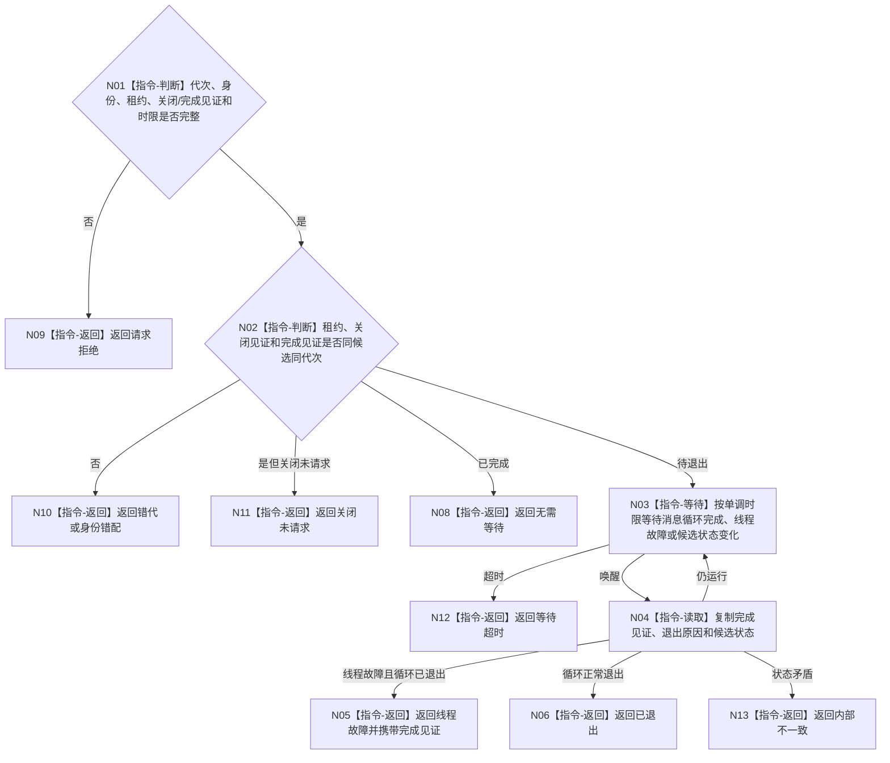

# BIZ-L4-001-09-03-02 等待控制面板消息循环退出目标函数流程图 v0.1

更新时间：2026-08-03

## 依据

```text
8110、8120；BIZ-L3-001-09-03；当前控制面板窗口消息循环
```

## 身份与边界

正式目标函数设计图。按单调时限等待指定候选的消息循环退出见证；不通过轮询窗口句柄消失、页面状态或显示文本推断退出。

## 函数合同

```text
根函数：等待控制面板消息循环退出
归属模块 / 文件 / 层级：控制面板线程 / 海中鱼巣/线程/控制面板线程.ixx / L4
现有或待新增：待新增；以具名完成见证替代窗口句柄轮询
完整签名：控制面板消息循环退出等待结果 等待控制面板消息循环退出(const 控制面板消息循环退出等待请求& 请求) noexcept
参数：请求为只读借用；含运行代次、线程逻辑身份、候选租约身份、关闭见证、消息循环完成见证和非零单调最长等待；候选租约覆盖等待
返回结果：不可变值式结果；含已退出、无需等待、请求拒绝、错代、身份错配、关闭未请求、线程故障、等待超时或内部不一致，以及退出原因和完成版本
被调函数流程图：无；条件等待、伪唤醒复核和见证复制为本函数内指令
父图：BIZ-L3-001-09-03
```

## 流程图



## 节点合同

| 节点 | 类型 | 参数 / 输入绑定 | 结果 / 输出绑定 | 事实读写 | 后继条件 | 验证 |
| --- | --- | --- | --- | --- | --- | --- |
| N02 | 指令-判断 | 候选和见证 | 等待资格 | 无 | 同候选且已请求关闭 | 错代和旧见证 |
| N03/N04 | 指令 | 单调时限和完成见证 | 退出原因 | 只读线程状态 | 完成、故障或超时 | 伪唤醒和墙钟跳变 |
| N05/N06 | 指令-返回 | 完成副本 | 结构化退出结果 | 无 | 消息循环确已退出 | 窗口消失不替代完成见证 |

## 关键边界

线程故障可以伴随消息循环已经退出；调用方仍须继续连接线程。UI消息循环退出不是普通宿主业务收口完成，也不能决定进程退出码。
