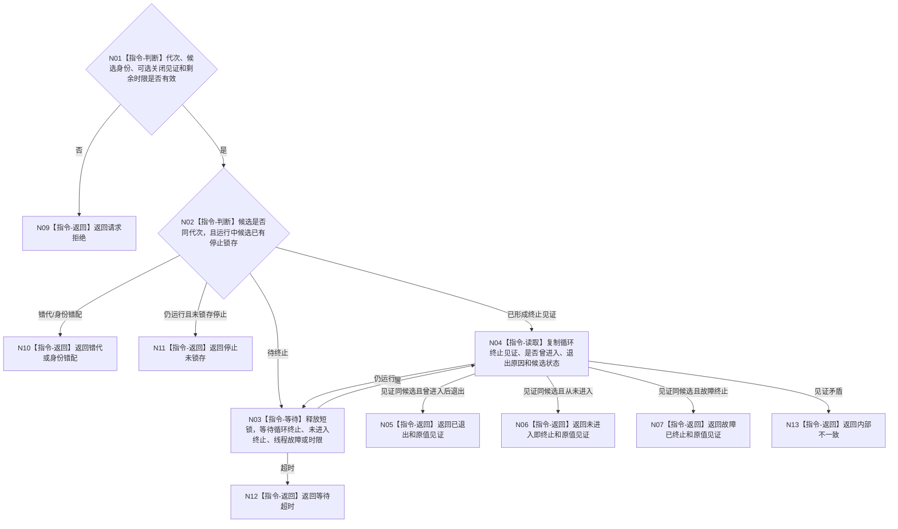

# BIZ-L4-001-09-03-02 等待控制面板消息循环退出目标函数流程图 v0.1

更新时间：2026-08-27

## 依据

```text
0050、8110 v0.3、8120 v0.10；BIZ-L3-001-09-03；BIZ-L1-T05 v0.4
```

## 身份与边界

正式目标函数设计图。按单调剩余时限等待指定候选形成一个内部终止见证：已经进入过消息循环者证明循环退出；窗口创建/显示失败或线程提前故障者证明从未进入即终止。请求不得预先携带尚未形成的完成见证，也不通过8110投影或窗口句柄消失推断终止。

## 函数合同

```text
根函数：等待控制面板消息循环退出
归属模块 / 文件 / 目标分解深度：控制面板线程 / 海中鱼巣/线程/控制面板线程.ixx / BIZ-L4
现有或待新增：待新增；HEAD无T05内部循环终止槽或结构化等待入口
完整签名：控制面板消息循环退出等待结果 等待控制面板消息循环退出(const 控制面板消息循环退出等待请求& 请求) noexcept
参数：请求为只读借用；含运行代次、线程/候选身份、可选停止/关闭见证和非零单调剩余时限；候选租约覆盖等待，不携带消息循环或线程完成见证
返回结果：不可变值式结果；含已退出、未进入即终止、故障已终止、请求拒绝、错代、身份错配、停止未锁存、等待超时或内部不一致，以及内部循环终止见证和原因
被调函数流程图：无；条件等待、伪唤醒复核和内部值式槽复制为本函数内指令
父图：BIZ-L3-001-09-03
```

## 流程图



## 节点合同

| 节点 | 类型 | 参数 / 输入绑定 | 结果 / 输出绑定 | 事实读写 | 后继条件 | 验证 |
| --- | --- | --- | --- | --- | --- | --- |
| N01—N03 | 判断 / 等待 | 候选、可选关闭见证和统一截止 | 唤醒或结构化非成功 | 只读候选内部槽 | 活候选须先锁存停止 | 错代、无关闭、墙钟跳变、伪唤醒 |
| N04—N07 | 读取 / 返回 | 内部终止槽 | 三种可连接终止形状 | 无业务写入 | 终止见证绑定同候选 | 正常退出、创建失败、异常退出 |
| N09—N13 | 返回 | 精确非成功 | 结构化结果 | 不关闭、不join | 租约仍归调用方 | 超时和矛盾载荷 |

## 关键边界

终止见证只证明T05私有入口已经不再运行窗口消息循环，或从未取得该资格；它还不证明外层线程wrapper已完成。BIZ-L4-001-09-03-03必须继续等待内部线程完成见证再join。8110终态投影即使已发布也不能替代这两个内部见证。
