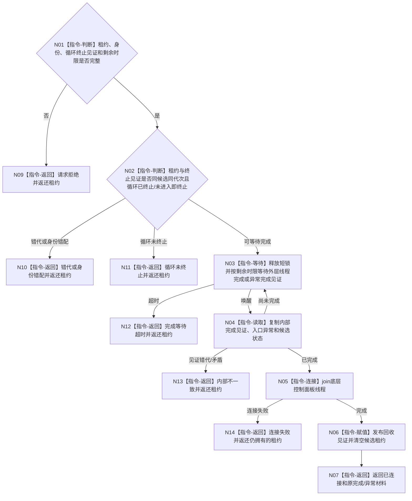

# BIZ-L4-001-09-03-03 连接控制面板线程候选目标函数流程图 v0.1

更新时间：2026-08-27

## 依据

```text
0050、8110 v0.3、8120 v0.10；BIZ-L3-001-09-03；BIZ-L4-001-09-03-02
```

## 身份与边界

正式目标函数设计图。只在循环终止见证成立后，按统一剩余时限等待候选外层线程wrapper发布内部完成见证，再连接底层线程并释放唯一租约。请求不预先携带尚未形成的线程完成见证；8110退出投影不能替代内部完成。

## 函数合同

```text
根函数：连接控制面板线程候选
归属模块 / 文件 / 目标分解深度：线程启动协调 / 海中鱼巣/启动.线程组协调.ixx / BIZ-L4
现有或待新增：待新增；发布源码无T05候选、内部完成见证或结构化连接入口
完整签名：控制面板线程候选连接结果 连接控制面板线程候选(控制面板线程候选租约&& 候选租约, const 控制面板线程候选连接请求& 请求) noexcept
参数：候选租约为唯一移动所有权；请求为只读借用，含运行代次、逻辑线程/候选身份、BIZ-L4-001-09-03-02循环终止见证和非零单调剩余时限；不携带线程完成见证
返回结果：移动值式结果；含已连接、请求拒绝、错代、身份错配、循环未终止、完成等待超时、连接失败或内部不一致；全部未连接结果返还唯一候选租约
被调函数流程图：无；等待内部完成、join和回收见证均为本函数内资源指令
父图：BIZ-L3-001-09-03
```

## 流程图



## 节点合同

| 节点 | 类型 | 参数 / 输入绑定 | 结果 / 输出绑定 | 事实读写 | 后继条件 | 验证 |
| --- | --- | --- | --- | --- | --- | --- |
| N01—N02 | 判断 | 候选和循环终止见证 | 连接等待资格 | 只读内部槽 | 循环已终止或从未进入 | 旧见证、错候选和故障终止 |
| N03—N04 | 等待 / 读取 | 统一剩余时限 | 内部完成见证 | 无业务写入 | 外层wrapper已完成 | 虚假唤醒、异常完成、超时 |
| N05—N07 | 连接 / 赋值 / 返回 | 唯一线程租约 | join和回收见证 | 释放本地线程资源 | 只连接一次 | join错误、双join和租约清空 |
| N09—N14 | 返回 | 精确非成功 | 原唯一租约 | 不detach、不丢租约 | 上级继续持有 | 每个未连接分支租约守恒 |

## 关键边界

连接成功仅证明T05候选线程资源已回收，不证明普通宿主、其它线程或任何业务已经收口。完成等待超时和连接异常都必须返还唯一租约；禁止用生命周期投影、窗口消失或析构副作用绕过内部完成见证和join。
