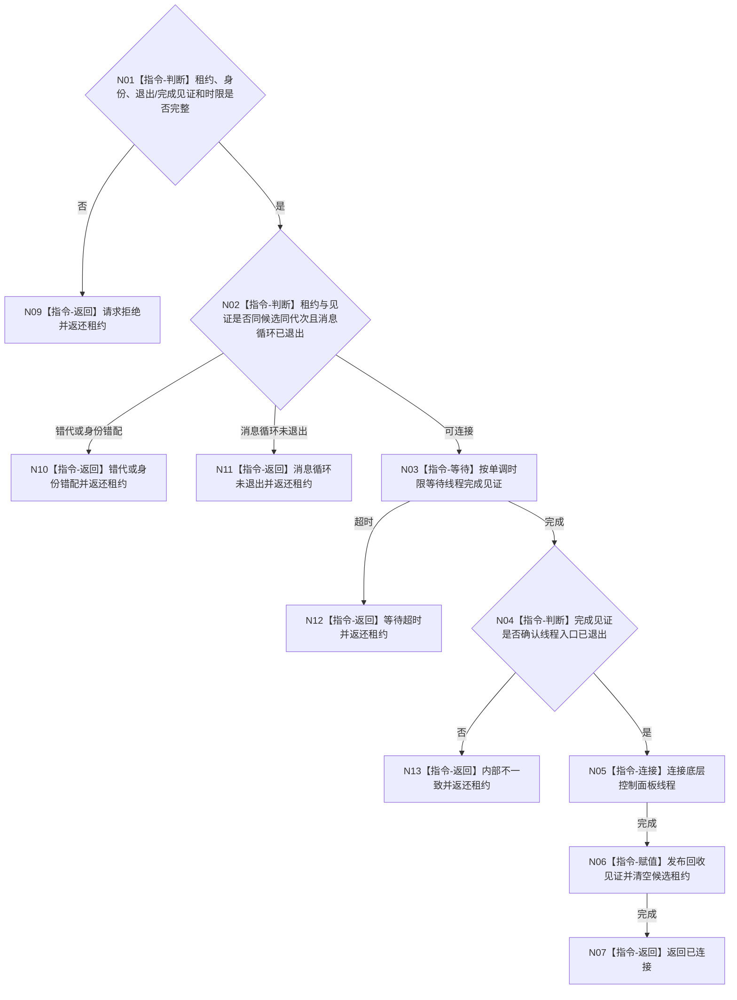

# BIZ-L4-001-09-03-03 连接控制面板线程候选目标函数流程图 v0.1

更新时间：2026-08-03

## 依据

```text
8110、8120；BIZ-L3-001-09-03
```

## 身份与边界

正式目标函数设计图。只在消息循环退出见证成立后连接控制面板候选线程并释放唯一租约；不负责首次关闭窗口或正式宿主停机。

## 函数合同

```text
根函数：连接控制面板线程候选
归属模块 / 文件 / 层级：线程启动协调 / 海中鱼巣/启动.线程组协调.ixx / L4
现有或待新增：待新增；使用join并补齐线程亲和完成见证、单调时限和租约返还
完整签名：控制面板线程候选连接结果 连接控制面板线程候选(控制面板线程候选租约&& 候选租约, const 控制面板线程候选连接请求& 请求) noexcept
参数：候选租约为唯一移动所有权；请求为只读借用，含运行代次、逻辑身份、窗口候选身份、消息循环退出见证、线程完成见证和非零单调最长等待
返回结果：移动值式结果；含已连接、请求拒绝、错代、身份错配、消息循环未退出、等待超时或内部不一致；全部未连接结果返还唯一候选租约
被调函数流程图：无；等待线程完成、join和回收见证为本函数内指令
父图：BIZ-L3-001-09-03
```

## 流程图



## 节点合同

| 节点 | 类型 | 参数 / 输入绑定 | 结果 / 输出绑定 | 事实读写 | 后继条件 | 验证 |
| --- | --- | --- | --- | --- | --- | --- |
| N02 | 指令-判断 | 候选和退出见证 | 连接资格 | 只读线程状态 | 消息循环已退出 | 错窗口和旧见证 |
| N03/N04 | 指令 | 完成见证和时限 | 完成或超时 | 无 | 线程入口已退出 | 伪唤醒和异常退出 |
| N05/N06 | 指令 | 唯一线程租约 | 连接和回收见证 | 释放线程资源 | 只连接一次 | 双join、detach和租约丢失 |

## 关键边界

连接成功仅证明UI线程资源已回收；任务、自我、外设和支持线程仍由程序主线程的其它停机阶段分别收口。
