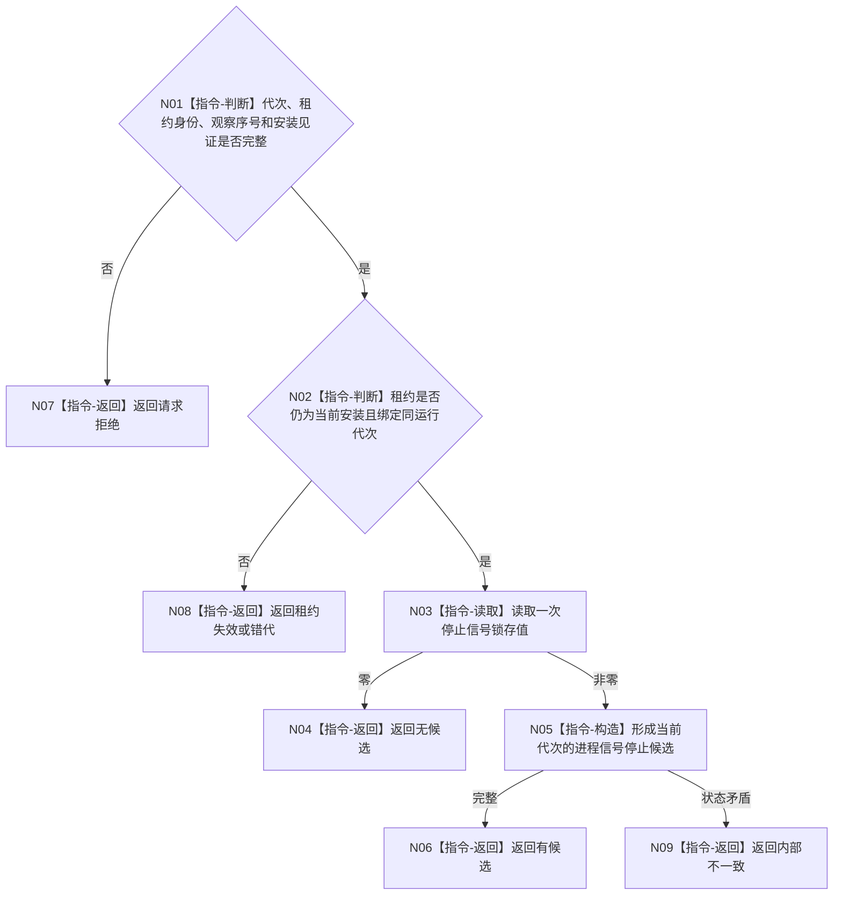

# BIZ-L4-001-10-01-01 读取进程停止信号候选目标函数流程图 v0.1

更新时间：2026-08-03

## 依据

```text
8120；BIZ-L3-001-10-01；当前停止信号租约
```

## 身份与边界

正式目标函数设计图。只读取异步信号处理器已锁存的进程停止标志并形成值式候选；不在信号处理器内执行线程停止、分配内存或领域逻辑。

## 函数合同

```text
根函数：读取进程停止信号候选
归属模块 / 文件 / 层级：程序运行宿主 / 海中鱼巣/启动.程序运行宿主.ixx / L4
现有或待新增：适配扩展；复用停止信号租约的sig_atomic_t锁存，补齐运行代次和观察序号
完整签名：进程停止信号候选结果 读取进程停止信号候选(const 进程停止信号候选读取请求& 请求) noexcept
参数：请求为只读借用；含运行代次、停止信号租约身份、观察序号和信号安装见证；租约覆盖读取
返回结果：不可变值式结果；含有候选、无候选、请求拒绝、租约失效、错代或内部不一致，以及信号来源身份、观察序号和锁存值
被调函数流程图：无；sig_atomic_t读取、租约复核和值式构造为本函数内指令
父图：BIZ-L3-001-10-01
```

## 流程图



## 节点合同

| 节点 | 类型 | 参数 / 输入绑定 | 结果 / 输出绑定 | 事实读写 | 后继条件 | 验证 |
| --- | --- | --- | --- | --- | --- | --- |
| N02/N03 | 指令 | 信号租约 | 锁存值 | 只读进程信号状态 | 当前租约 | 旧租约和并发信号 |
| N05 | 指令-构造 | 非零锁存和观察序号 | 停止候选 | 无业务写入 | 身份完整 | 不伪造具体未保存信号号 |

## 关键边界

当前实现只锁存“收到停止信号”，没有可靠保存具体信号号，因此目标合同不得伪造 SIGINT/SIGTERM/SIGBREAK 细分来源；若未来需要细分，必须先升级异步信号安全存储合同。
