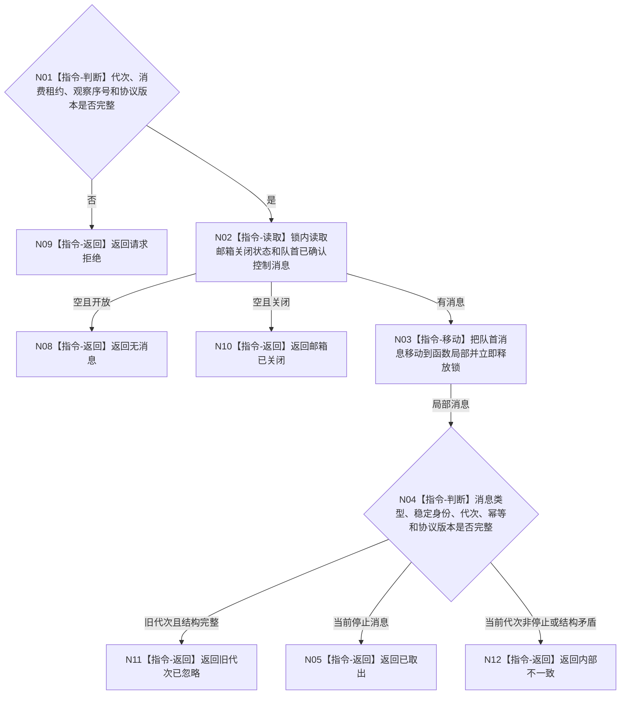

# BIZ-L4-001-10-01-02 尝试取出程序控制停止消息目标函数流程图 v0.1

更新时间：2026-08-03

## 依据

```text
8110、8120；BIZ-L2-005-05；BIZ-L3-001-10-01
```

## 身份与边界

正式目标函数设计图。只从程序控制邮箱尝试移动一条已确认的停止控制消息；不读取UI文本，不把窗口关闭或显示状态解释为停止请求。

## 函数合同

```text
根函数：程序控制邮箱::尝试取出停止消息
归属模块 / 文件 / 层级：程序控制消息 / 海中鱼巣/线程/程序控制邮箱.ixx / L4
现有或待新增：待新增；复用有界消息队列，新增强类型停止控制消息和当前代次过滤
完整签名：程序控制停止消息取出结果 程序控制邮箱::尝试取出停止消息(const 程序控制停止消息取出请求& 请求)
参数：请求为只读借用；含运行代次、邮箱消费租约、观察序号和当前停止协议版本；消费租约覆盖调用
返回结果：移动值式结果；含已取出、无消息、旧代次已忽略、邮箱已关闭、请求拒绝或内部不一致，以及不可变停止消息、来源身份和邮箱版本
被调函数流程图：无；锁内短时取出、类型/代次复核和锁外值式返回为本函数内指令
父图：BIZ-L3-001-10-01
```

## 流程图



## 节点合同

| 节点 | 类型 | 参数 / 输入绑定 | 结果 / 输出绑定 | 事实读写 | 后继条件 | 验证 |
| --- | --- | --- | --- | --- | --- | --- |
| N02/N03 | 指令 | 邮箱消费租约 | 局部值式消息 | 只移动队列项 | 锁内不调用外部服务 | 空、关闭和并发生产 |
| N04 | 指令-判断 | 局部消息 | 当前停止候选或具名非成功 | 无业务写入 | 类型和代次完整 | 旧消息、伪停止和重复幂等 |

## 关键边界

程序控制邮箱只承载宿主控制，不承载需求、任务、世界或结算事实。旧代次消息被收束后不得重新入队参与下一代次竞争。

