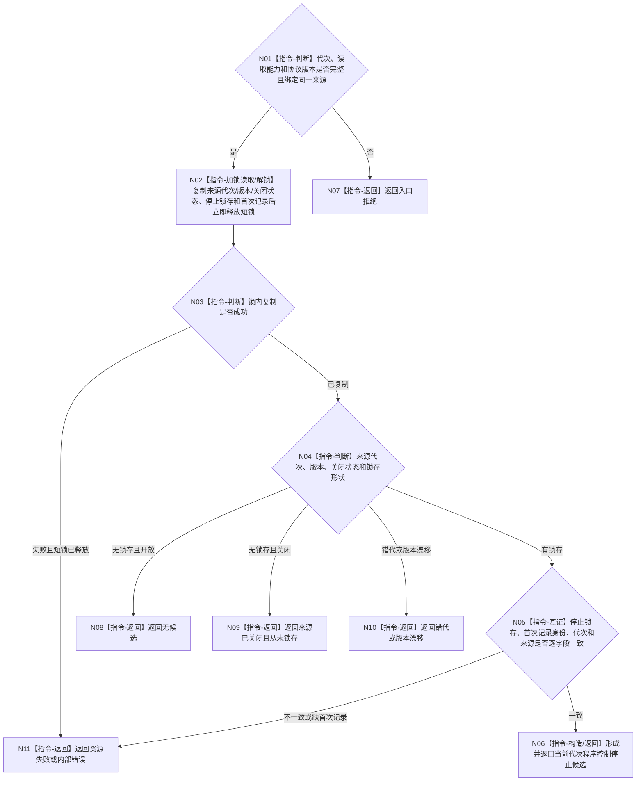

# BIZ-L4-001-10-01-02 读取程序控制停止来源候选目标函数流程图 v0.1

更新时间：2026-08-28

## 依据

```text
8100 v0.7、8120 v0.10；BIZ-L2-005-05 v0.2；BIZ-L3-005-05-02 v0.2；BIZ-L3-001-10-01
BIZ-L3-001-02-02 v0.1
```

## 身份与边界

正式目标职责图。只经程序控制停止来源的读取分面，在同一短临界区内非破坏性读取当前运行代次的停止锁存及其不可变首次记录。通知只用于唤醒 T01；单独通知、窗口关闭、显示状态或“来源存在”均不能证明停止请求成立。

本函数不移动、删除或确认消费停止记录。其它来源同时出现、父层结构检查失败或有界等待重试后，下一次读取仍必须得到同一首次锁存，直到当前运行代次完成收口并释放来源租约。

## 函数合同

```text
根目标：程序控制停止来源读取端::读取停止锁存候选
归属模块 / 文件 / 目标分解深度：程序控制停止来源 / 物理模块待统一详细设计选择 / BIZ-L4
现有或待新增：待新增；复用BIZ-L3-005-05-02原子形成的停止锁存和首次不可变记录
候选签名：程序控制停止锁存候选结果 程序控制停止来源读取端::读取停止锁存候选(const 程序控制停止锁存候选读取请求& 请求) const noexcept
参数最低职责：运行代次、绑定同一来源拥有体的读取能力和协议版本；不得要求队列游标或观察序号
返回结果最低分类：有候选、无候选、来源已关闭、入口拒绝、错代、版本漂移、资源失败或内部错误；成功候选携带同一首次记录及来源绑定
被调函数流程图：无；锁内复制来源元数据、停止锁存与首次记录，锁外逐字段互证和值式构造均为本函数内指令
父图：BIZ-L3-001-10-01
```

## 流程图



## 关键边界

- BIZ-L3-005-05-02必须先原子形成停止锁存及其不可变首次记录，再发出唤醒；本函数不能从通知、窗口关闭或来源状态补造锁存。
- 读取幂等且非破坏。当前运行代次只保留第一份已接受停止锁存；后到精确重复不改变首次记录，异义请求不能替换它。
- 来源关闭且已有完整锁存时仍返回该候选；“来源已关闭”只适用于关闭时从未形成锁存的形状。
- 本函数只证明程序控制来源提出合法停止候选；只有 BIZ-L2-001-10 可以锁存全局程序停止阶段并决定首要停止原因。
