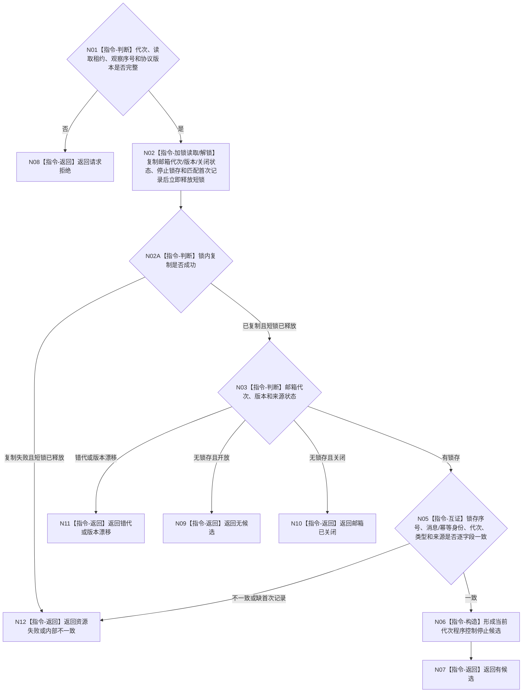

# BIZ-L4-001-10-01-02 读取程序控制停止锁存候选目标函数流程图 v0.1

更新时间：2026-08-27

## 依据

```text
8110 v0.3、8120 v0.10；BIZ-L2-005-05 v0.2；BIZ-L3-005-05-02 v0.2；BIZ-L3-001-10-01；确认稿第30项
```

## 身份与边界

正式目标函数设计图。只在程序控制邮箱短锁内非破坏性读取当前运行代次已经原子成立的停止锁存及其不可变首次记录。通知消息只用于唤醒 T01；单独消息、队列非空、窗口关闭或显示状态均不能证明停止请求已经成立。

本函数不移动、删除或确认消费停止记录。其它来源同时出现、父层结构检查失败或有界等待重试后，下一次读取仍必须得到同一首次锁存，直到当前运行代次完成收口并释放邮箱租约。

## 函数合同

```text
根函数：程序控制邮箱::读取停止锁存候选
归属模块 / 文件 / 目标分解深度：程序控制消息 / 海中鱼巣/线程/程序控制邮箱.ixx / BIZ-L4
现有或待新增：待新增；复用BIZ-L3-005-05-02原子形成的停止锁存、首次不可变记录和幂等索引
完整签名：程序控制停止锁存候选结果 程序控制邮箱::读取停止锁存候选(const 程序控制停止锁存候选读取请求& 请求) const noexcept
参数：请求为只读借用；含运行代次、邮箱读取租约、观察序号和当前停止协议版本；读取租约覆盖调用
返回结果：不可变值式结果；含有候选、无候选、邮箱已关闭、请求拒绝、错代、版本漂移、资源失败或内部不一致，以及停止锁存序号、首次消息身份、来源身份、观察序号和不可变首次记录
被调函数流程图：无；锁内复制邮箱元数据、停止锁存与首次记录，锁外逐字段互证和值式构造均为本函数内指令
父图：BIZ-L3-001-10-01
```

## 流程图



## 节点合同

| 节点 | 类型 | 参数 / 输入绑定 | 结果 / 输出绑定 | 事实读写 | 后继条件 | 验证 |
| --- | --- | --- | --- | --- | --- | --- |
| N01—N03 | 判断 / 加锁读取 / 解锁 | 当前读取请求与邮箱租约 | 同一锁截面的锁存、首次记录和邮箱状态副本 | 只读程序控制源 | 短锁内不调用外部服务且所有路径释放锁 | 空、关闭、错代、版本漂移和复制失败 |
| N05—N07 | 互证 / 构造 / 返回 | 锁存与首次记录副本 | 当前代次停止候选 | 无写入、无出队 | 锁存和记录同义 | 伪唤醒、孤立消息、锁存无记录、记录异义 |
| N08—N12 | 返回 | 精确非成功条件 | 空候选和结构化状态 | 无写入 | 不改变邮箱 | 重试后同一锁存仍可读 |

## 关键边界

- BIZ-L3-005-05-02 必须先原子形成停止锁存及其不可变首次记录，再发出唤醒；本函数不能从通知、窗口关闭、UI文本或队列长度补造锁存。
- 读取是幂等且非破坏性的。程序控制来源在当前运行代次只保留第一份已接受停止锁存；后到精确重复不改变首次记录，异义请求不能替换它。
- 本函数只证明程序控制来源已经提出合法停止候选。只有父函数 BIZ-L2-001-10 可以锁存全局程序停止阶段并决定首要停止原因。
- 邮箱关闭且已有完整锁存时仍应返回该候选；“邮箱已关闭”只适用于关闭时从未形成停止锁存的形状。
