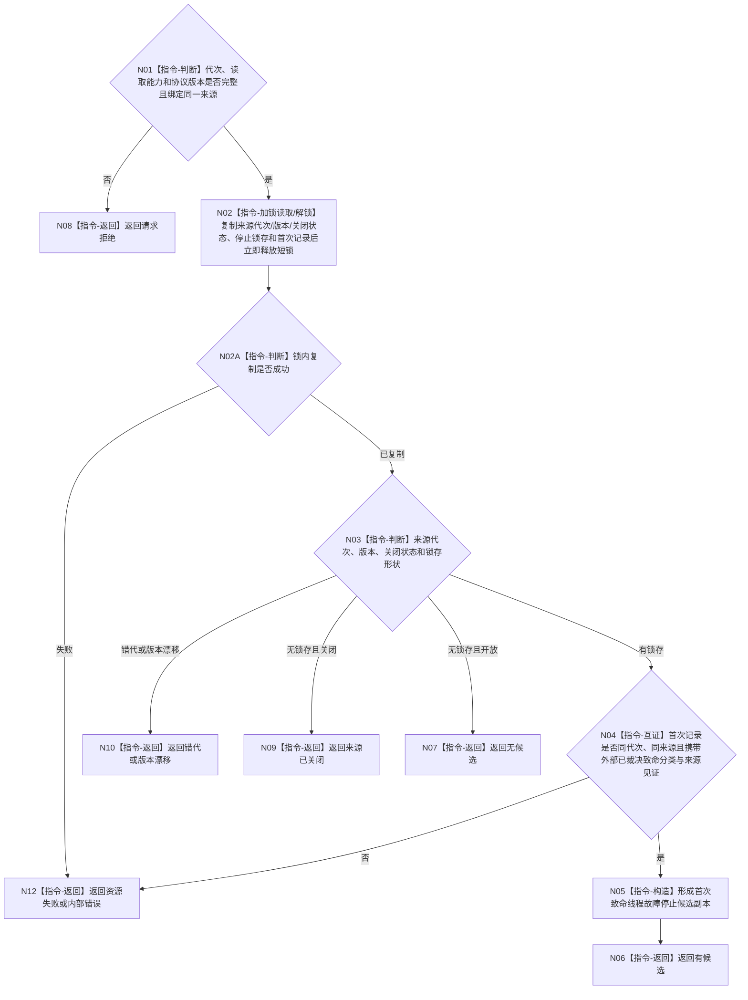

# BIZ-L4-001-10-01-03 读取致命线程故障停止候选目标函数流程图 v0.1

更新时间：2026-08-28

## 依据

```text
8110 v0.3、8120 v0.10；BIZ-L3-001-10-01；确认稿第30项
```

## 身份与边界

正式目标职责图。只经致命线程故障停止来源的读取分面，非破坏性读取已经由具名宿主故障合同裁决为“必须停止本运行代次”的首次锁存材料；普通线程故障、退出、堵塞或投影缺失均不在本函数内升级为致命。

本函数不读取观察邮箱、候选组、历史队列或 8110 投影。致命分类生产者和来源逐字段 ABI 尚未冻结，统一受 `DRIFT-BIZ-HOST-FATAL-FAULT-CLASSIFIER-AND-SOURCE-ABI-UNFROZEN` 限制；本图只冻结读取职责，不能授权代码实现。

## 函数合同

```text
根函数：读取致命线程故障停止候选
归属模块 / 文件 / 目标分解深度：程序运行宿主 / 海中鱼巣/启动.程序运行宿主.ixx / BIZ-L4
现有或待新增：待新增；消费致命线程故障停止来源，不直接消费8110普通生命周期缓存；受具名 DRIFT 限制
候选签名：致命线程故障停止候选结果 致命线程故障停止来源读取端::读取停止锁存候选(const 致命线程故障停止候选读取请求& 请求) const noexcept
参数最低职责：运行代次、绑定同一来源拥有体的读取能力和协议版本；不得要求观察游标、观察批序号、业务事实截止或候选容量
返回结果最低分类：有候选、无候选、来源已关闭、入口拒绝、错代、版本漂移、资源失败或内部错误；成功候选携带首次不可变记录及来源绑定；逐字段 ABI 待具名 DRIFT 闭合
被调函数流程图：无；锁内复制来源元数据、停止锁存和首次记录，锁外互证和值式构造均为本函数内指令
父图：BIZ-L3-001-10-01
```

## 流程图



## 节点合同

| 节点 | 类型 | 参数 / 输入绑定 | 结果 / 输出绑定 | 事实读写 | 后继条件 | 验证 |
| --- | --- | --- | --- | --- | --- | --- |
| N02/N02A/N03 | 读取 / 判断 | 致命停止来源读取分面 | 首次锁存或来源状态 | 只读宿主停止材料 | 同代次同版本 | 旧代次、空来源、关闭和复制失败 |
| N04 | 指令-互证 | 首次记录、分类和来源见证 | 完整或内部错误 | 无业务写入 | 外部合同已裁决 | 不从8110状态自行推导致命 |

## 关键边界

本函数不定义哪些故障致命；分类必须由相关线程/宿主正式合同冻结。线程生命周期投影缺失、控制面板不可用和旁路写入失败不能自动触发进程停机。来源关闭且已有完整首次锁存时仍返回候选；读取不移动或删除首次记录。

## 2026-08-27 校正记录

- 把端口读取与“关闭 / 空 / 有候选”判断拆成两个节点，保证端口关闭但仍带已分类候选时不会丢弃候选。
- 保持致命分类生产者和 DTO 为详细设计缺口；本叶只读外部已裁决材料，不从 8110、日志或普通线程状态反推。

## 2026-08-28 校正记录

- 删除观察序号、事实截止和候选组缓存假设，改为一次停止来源的非破坏性首次锁存读回。
- 明确当前图只冻结职责；分类生产者、提交/读取 ABI 和后到故障历史继续由具名 DRIFT 阻断。
