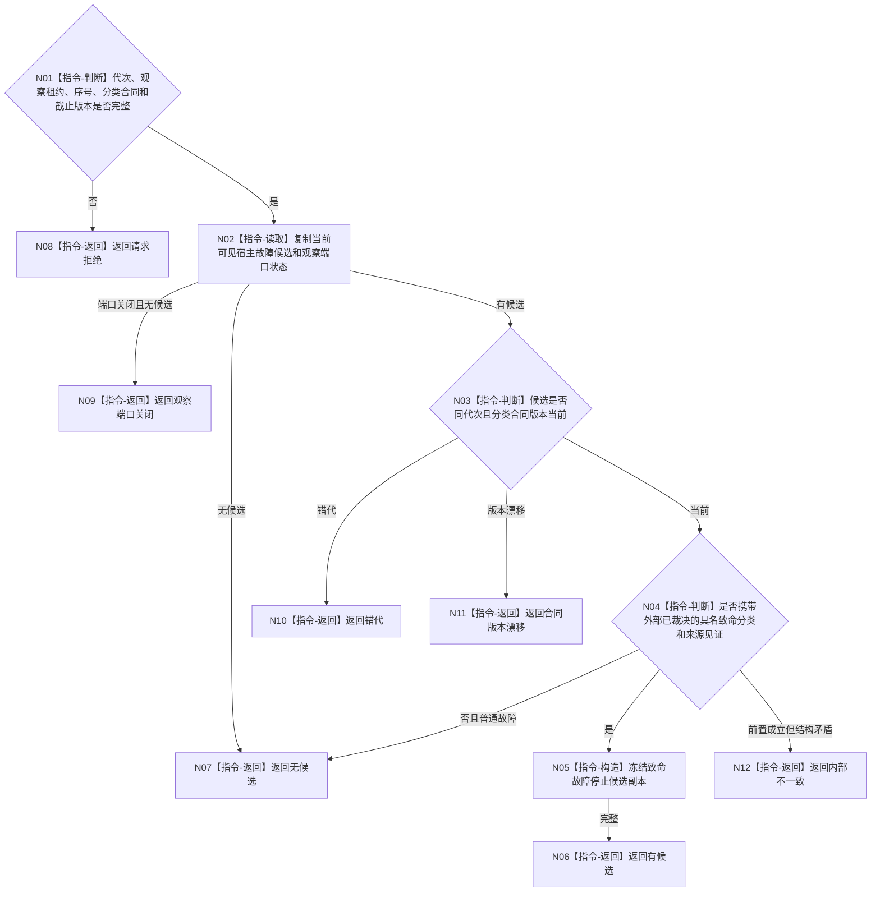

# BIZ-L4-001-10-01-03 读取致命线程故障停止候选目标函数流程图 v0.1

更新时间：2026-08-03

## 依据

```text
8110、8120；BIZ-L3-001-10-01
```

## 身份与边界

正式目标函数设计图。只读取已经由具名宿主故障合同裁决为“必须停止本运行代次”的线程故障候选；普通线程故障、退出、堵塞或投影缺失均不在本函数内升级为致命。

## 函数合同

```text
根函数：读取致命线程故障停止候选
归属模块 / 文件 / 层级：程序运行宿主 / 海中鱼巣/启动.程序运行宿主.ixx / L4
现有或待新增：待新增；消费宿主故障观察端口，不直接消费8110普通生命周期缓存
完整签名：致命线程故障停止候选结果 读取致命线程故障停止候选(const 致命线程故障停止候选读取请求& 请求)
参数：请求为只读借用；含运行代次、宿主故障观察租约、观察序号、致命故障分类合同版本和事实截止版本；租约覆盖读取
返回结果：不可变值式结果；含有候选、无候选、观察端口关闭、请求拒绝、错代、合同版本漂移或内部不一致，以及故障稳定身份、线程逻辑身份、具名致命分类和来源见证
被调函数流程图：无；观察端口当前候选复制和合同版本复核为本函数内只读指令
父图：BIZ-L3-001-10-01
```

## 流程图



## 节点合同

| 节点 | 类型 | 参数 / 输入绑定 | 结果 / 输出绑定 | 事实读写 | 后继条件 | 验证 |
| --- | --- | --- | --- | --- | --- | --- |
| N02/N03 | 指令 | 故障观察端口 | 当前候选 | 只读宿主故障材料 | 同代次同版本 | 旧故障和端口关闭 |
| N04 | 指令-判断 | 分类和来源见证 | 致命或普通 | 无业务写入 | 外部合同已裁决 | 不从8110状态自行推导致命 |

## 关键边界

本函数不定义哪些故障致命；分类必须由相关线程/宿主详细设计冻结。线程生命周期投影缺失、控制面板不可用和旁路写入失败不能自动触发进程停机。

