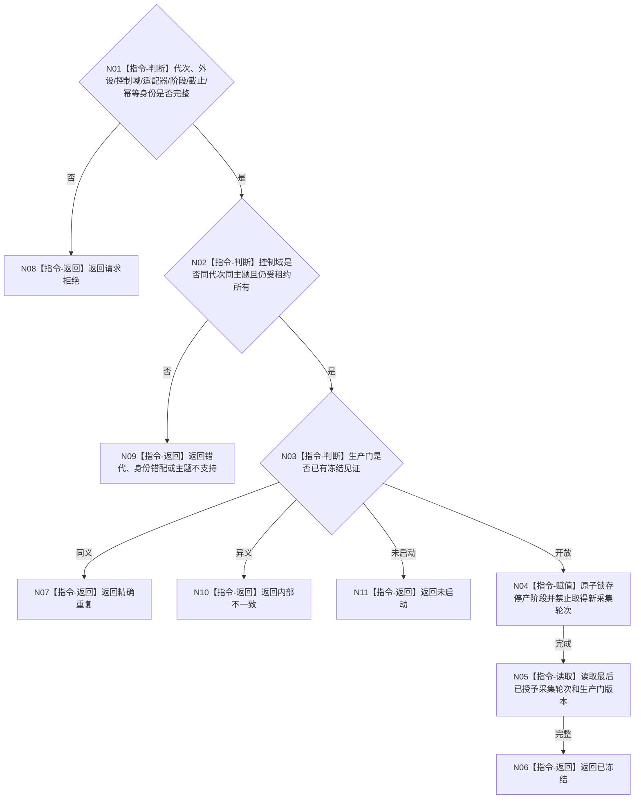

# BIZ-L4-001-13-01-01 冻结一个外设采集生产门目标函数流程图 v0.1

更新时间：2026-08-03

## 依据

```text
6340、8110；BIZ-L3-001-13-01
```

## 身份与边界

正式目标函数设计图。原子禁止一个外设控制域开始新的采集轮次，同时允许停产前已经形成的报告继续完成发布或转入接管；不消费报告、不关闭线程。

## 函数合同

```text
根函数：冻结一个外设采集生产门
归属模块 / 文件 / 层级：外设控制域协议 / 海中鱼巣/线程/协议.外设生产门.ixx / L4
现有或待新增：待新增；由各已登记外设主题实现同一生产门合同
完整签名：外设采集生产门冻结结果 冻结一个外设采集生产门(const 外设采集生产门冻结请求& 请求) noexcept
参数：请求为只读借用；含运行代次、外设稳定身份、控制域租约身份、主题适配器身份、停产阶段身份、报告截止身份和幂等身份；租约覆盖调用
返回结果：不可变值式结果；含已冻结、精确重复、未启动、请求拒绝、错代、身份错配、主题不支持或内部不一致，以及生产门版本和最后允许采集轮次
被调函数流程图：无；主题控制域内原子门冻结和见证发布为本函数内指令
父图：BIZ-L3-001-13-01
```

## 流程图



## 节点合同

| 节点 | 类型 | 参数 / 输入绑定 | 结果 / 输出绑定 | 事实读写 | 后继条件 | 验证 |
| --- | --- | --- | --- | --- | --- | --- |
| N02/N03 | 指令 | 控制域和幂等身份 | 冻结资格 | 只读控制域状态 | 同主题同代次 | 重复和异义冻结 |
| N04/N05 | 指令 | 停产阶段 | 门版本和最后轮次 | 只改采集生产门 | 原子禁止新轮次 | 并发取轮次与停产 |

## 关键边界

冻结发生前已取得轮次可以按既定策略完成或形成剩余材料；冻结后不得因重试、驱动回调或私有算法重新开始采集。
