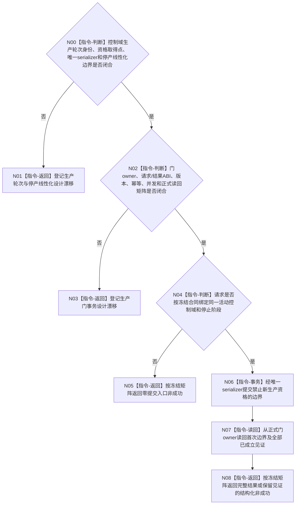

# BIZ-L4-001-13-01-01 冻结一个外设采集生产门目标函数流程图 v0.2

更新时间：2026-08-28

## 依据

```text
0050、6340 v0.6、8110 v0.3；BIZ-L1-T06 v0.5；BIZ-L2-001-13 v0.3；BIZ-L3-001-13-01 v0.2；
HEAD 海中鱼巣/启动.应用程序.ixx。
```

## 身份与边界

正式目标治理图。单个外设控制域需要一个能够把“允许取得新生产资格”线性化为“禁止取得新生产资格”的专属停产合同；停产边界之前已经取得的资格仍须由同一控制域按后继收尾合同处理。本叶只负责门边界，不消费报告、不裁决任务承接，也不把线程退出当作停产门见证。

6340没有定义采集轮次、生产资格取得点、门owner、门版本、最后允许轮次、停止请求/结果、幂等身份或并发矩阵。旧v0.1给出的具体模块、签名、字段、状态和“已可能冻结”矩阵均无正式依据，现予撤销。只有先冻结单控制域生产轮次和唯一serializer，再冻结门ABI与正式读回，本叶才能进入施工设计。

## 函数合同

```text
根函数候选：冻结一个外设采集生产门
归属模块 / 文件 / 目标分解深度：外设控制域停产协议 / 物理文件待门owner裁决 / BIZ-L4
现有或待新增：HEAD不存在该门、同名函数或专属协议模块
完整签名：未冻结；旧v0.1的外设采集生产门冻结请求/结果不构成ABI
参数：未冻结；必须绑定活动控制域、正式停止阶段、生产轮次边界和同义幂等语义
返回结果：未冻结；必须保存首次提交见证，并区分入口拒绝、精确重放、异义冲突、并发漂移、发布未知和正式读回
被调函数流程图：无；具体门owner和读回服务由合同闭合后确定
父图：BIZ-L3-001-13-01 v0.2
```

## 设计门禁与目标骨架



## 节点合同

| 节点 | 当前可确认合同 | 仍待冻结 | 验证边界 |
| --- | --- | --- | --- |
| N00/N01 | 冻结后不得取得新的生产资格；边界前材料由同一控制域继续收束 | 轮次身份、资格取得点、serializer和门前/门后分类 | 并发取得资格与停产必须有唯一线性化结果 |
| N02/N03 | 同键同义重放不得形成第二边界；发布未知不能换键重试 | DTO字段、枚举数值、版本、幂等、异义冲突、漂移、资源与内部矩阵 | bool或本地门变量不能证明正式重放和读回 |
| N04—N08 | 入口拒绝必须零提交，提交后已成立见证必须守恒 | 正式停止阶段绑定、首次提交见证和读回截止 | 首次、重复、并发、发布未知和读回失败分账 |

## 当前已发布代码对应（`28125acb`；相关源码自`f2fea3fb`后未变）

- HEAD没有真实外设控制域线程组；`启动外设线程组()`恒true，`收口并连接外设线程组()`为空。
- 6340没有公开单控制域采集生产门或轮次接口；不能从“每实例独立控制域”推导门的物理位置和事务。

## 具名偏差

1. `DRIFT-BIZ-T06-DEVICE-CONTROL-DOMAIN-PRODUCTION-ROUND-AND-STOP-LINEARIZATION-UNFROZEN`
2. `DRIFT-BIZ-T06-PRODUCTION-STOP-GATE-ABI-IDEMPOTENCY-READBACK-AND-CONCURRENCY-MATRIX-UNFROZEN`

## v0.2校正记录

- 撤销旧v0.1的协议文件、函数签名、门版本、最后允许采集轮次和完整状态矩阵。
- 仅保留“唯一serializer提交停产边界、正式owner读回、边界后零新生产资格”的目标骨架。
- 将轮次/线性化和门ABI/幂等/读回拆成两道必须先闭合的设计门禁。
