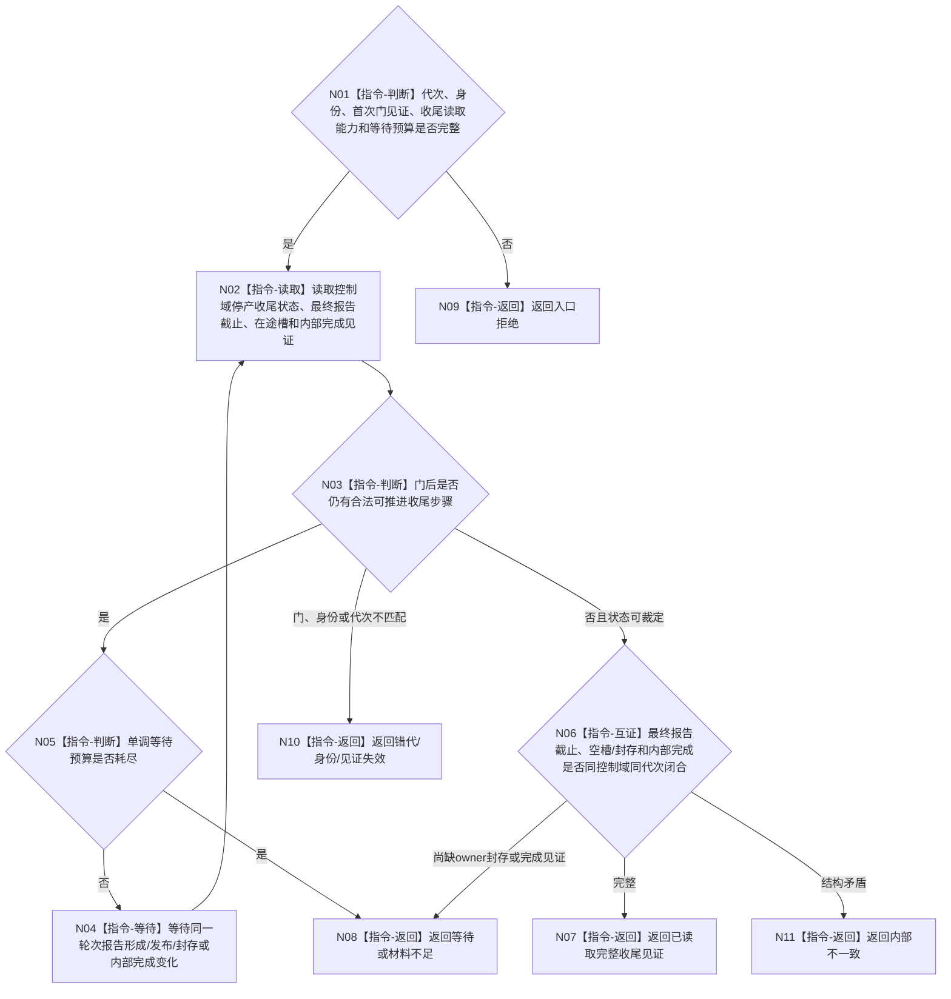

# BIZ-L4-001-13-01-02 等待并读取一个外设停产收尾见证目标函数流程图 v0.1

更新时间：2026-08-27

## 依据

```text
6340 v0.6、8110 v0.3；BIZ-L1-T06 v0.4；BIZ-L3-001-13-01；BIZ-L4-001-13-01-01
```

## 身份与边界

正式目标函数设计图。生产门冻结后，等待同一外设控制域完成停产前已取得采集轮次的报告形成、发布重试或合法封存，并读取最终报告截止、唯一在途槽收口和内部完成见证。它不消费报告、不等待任务域完成承接，也不按队列尾项猜测最终截止。

## 函数合同

```text
根函数：等待并读取一个外设停产收尾见证
归属模块 / 文件 / 目标分解深度：外设控制域协议 / 海中鱼巣/线程/协议.外设生产门.ixx / BIZ-L4
现有或待新增：待新增；目标T06控制域须发布内部停产收尾见证，HEAD无该模块
完整签名：外设停产收尾读取结果 等待并读取一个外设停产收尾见证(const 外设停产收尾读取请求& 请求) noexcept
参数：请求为只读借用；含运行代次、外设/控制域/租约身份、生产门首次冻结见证、停产阶段、内部收尾读取能力和非零单调等待预算
返回结果：不可变值式结果；含已读取、等待、入口拒绝、错代、身份错配、门见证失效、材料不足、资源失败或内部不一致，以及可选最后报告身份/生产序号、空槽或外设owner封存见证和内部完成见证
被调函数流程图：无；等待、内部见证读取和纯值互证为本函数内指令
父图：BIZ-L3-001-13-01
```

## 流程图



## 节点合同

| 节点 | 类型 | 输入 | 输出 | 事实读写 | 验证 |
| --- | --- | --- | --- | --- | --- |
| N01—N03 | 判断 / 读取 | 首次门见证和控制域 | 当前收尾状态 | 只读控制域内部槽和见证 | 停产前轮次晚到、无报告、发布重试、封存 |
| N04—N05 | 等待 / 判断 | 当前未完成步骤和预算 | 重新读取资格或等待 | 无业务写入 | 伪唤醒、预算耗尽、资源失败 |
| N06—N11 | 互证 / 返回 | 最终截止、材料和完成见证 | 完整或具名非成功 | 不消费/复制报告 | 空槽、强类型封存、身份/版本矛盾 |

## 关键边界

- 最终报告身份可以为空，表示该控制域本运行代次没有形成报告；这不等于读取失败。
- 队列为空不能证明无不可舍弃报告。只有在途槽为空，或不可舍弃材料已由外设 owner 封存且正式可读，才具备材料收口见证。
- 生命周期投影“已退出”不能替代控制域内部完成见证；本函数也不执行 join。
