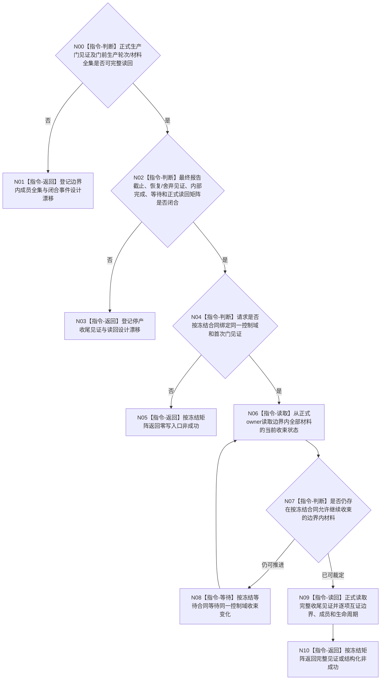

# BIZ-L4-001-13-01-02 等待并读取一个外设停产收尾见证目标函数流程图 v0.2

更新时间：2026-08-28

## 依据

```text
0050、6340 v0.6、8110 v0.3；BIZ-L1-T06 v0.5；BIZ-L2-001-13 v0.3；
BIZ-L3-001-13-01 v0.2、BIZ-L4-001-13-01-01 v0.2；发布源码相关启动代码。
```

## 身份与边界

正式目标治理图。生产门边界成立后，仍需要等待并正式读取该边界之前已经进入控制域的材料是否全部完成发布、合法舍弃或按6340进入可恢复强类型报告/承接事实。该读取不能消费报告、不能代替任务域承接，也不能用队列为空、当前尾项、线程退出或生命周期投影证明材料已经闭合。

6340只冻结不可舍弃材料的恢复原则，没有定义采集轮次、边界内成员全集、最终报告截止、在途槽、封存owner、内部完成见证或等待预算。旧v0.1给出的请求/结果、可选最后报告、空槽/封存见证和状态矩阵均无正式来源。必须先冻结门前材料全集及其闭合事件，再冻结收尾见证owner、生命周期、正式读回和等待/资源矩阵。

## 函数合同

```text
根函数候选：等待并读取一个外设停产收尾见证
归属模块 / 文件 / 目标分解深度：外设控制域停产协议 / 物理文件待收尾见证owner裁决 / BIZ-L4
现有或待新增：发布源码不存在该见证、同名函数、最终报告截止或独立读回
完整签名：未冻结；旧v0.1的外设停产收尾读取请求/结果不构成ABI
参数：未冻结；必须绑定正式生产门见证、边界内成员全集、同一控制域和冻结的等待语义
返回结果：未冻结；必须区分等待、材料不足、边界/身份漂移、资源失败、内部不一致和完整正式读回
被调函数流程图：无；等待能力与收尾见证读回由合同闭合后确定
父图：BIZ-L3-001-13-01 v0.2
```

## 设计门禁与目标骨架



## 节点合同

| 节点 | 当前可确认合同 | 仍待冻结 | 验证边界 |
| --- | --- | --- | --- |
| N00/N01 | 门前已进入控制域的不可舍弃材料不得因停产丢失 | 轮次/材料成员身份、全集owner、枚举键、边界和闭合事件 | 队列当前内容或尾项不能证明过去完整集合 |
| N02/N03 | 不可舍弃材料须形成可恢复强类型报告或承接事实；普通过期材料可按正式策略舍弃 | 最终截止、恢复/舍弃owner、生命周期、内部完成和合法空集证明 | “没有收到报告”不能冒充合法0项或完成 |
| N04—N10 | 只等待和读取，不消费报告、不写业务事实、不执行join | 请求/结果ABI、等待预算、伪唤醒、漂移、资源和内部错误矩阵 | 晚到材料、发布重试、合法舍弃、恢复失败和读回矛盾均须分账 |

## 当前已发布代码对应（`28125acb`；相关源码自`f2fea3fb`后未变）

- 发布源码没有T06控制域、生产门、门前材料全集、最终报告截止或收尾见证；外设收口函数为空。
- 6340允许普通高频材料按正式条件不恢复，并要求不可舍弃材料可恢复，但没有形成供本叶直接调用的停止收尾provider。

## 具名偏差

1. `DRIFT-BIZ-T06-DEVICE-CONTROL-DOMAIN-PRODUCTION-ROUND-AND-STOP-LINEARIZATION-UNFROZEN`
2. `DRIFT-BIZ-T06-SHUTDOWN-TAIL-REPORT-CUTOFF-IN-FLIGHT-AND-RECOVERY-WITNESS-UNFROZEN`

## v0.2校正记录

- 撤销旧v0.1的等待请求/结果、最后报告身份、唯一在途槽、封存见证和内部完成矩阵。
- 把“队列为空/尾项”明确降为弱观察，必须以边界内完整成员和各正式生命周期结果形成收尾见证。
- 保留只等待与正式读回的目标职责，不消费报告、不执行join、不建立第二恢复owner。
