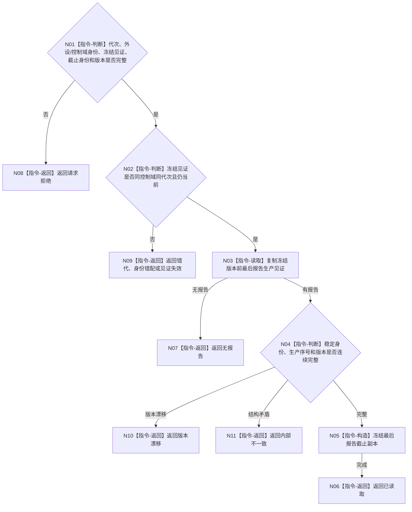

# BIZ-L4-001-13-01-02 读取一个外设最后已形成报告身份目标函数流程图 v0.1

更新时间：2026-08-03

## 依据

```text
6340；BIZ-L3-001-13-01；BIZ-L4-001-13-01-01
```

## 身份与边界

正式目标函数设计图。读取一个已冻结生产门控制域在截止见证前最后形成的报告稳定身份和连续生产序号；不按队列位置猜测截止，不消费或复制报告。

## 函数合同

```text
根函数：读取一个外设最后已形成报告身份
归属模块 / 文件 / 层级：外设控制域协议 / 海中鱼巣/线程/协议.外设生产门.ixx / L4
现有或待新增：待新增；消费主题控制域的只读报告生产见证
完整签名：外设最后报告身份读取结果 读取一个外设最后已形成报告身份(const 外设最后报告身份读取请求& 请求)
参数：请求为只读借用；含运行代次、外设稳定身份、控制域租约身份、生产门冻结见证、报告截止身份和事实截止版本；租约覆盖读取
返回结果：不可变值式结果；含已读取、无报告、请求拒绝、错代、身份错配、冻结见证失效、版本漂移或内部不一致，以及可选最后报告稳定身份、生产序号和生产版本
被调函数流程图：无；生产见证复制和连续性复核为本函数内只读指令
父图：BIZ-L3-001-13-01
```

## 流程图



## 节点合同

| 节点 | 类型 | 参数 / 输入绑定 | 结果 / 输出绑定 | 事实读写 | 后继条件 | 验证 |
| --- | --- | --- | --- | --- | --- | --- |
| N02/N03 | 指令 | 冻结见证和控制域 | 最后生产见证 | 只读，不出队 | 见证当前 | 冻结后并发完成报告 |
| N04/N05 | 指令 | 报告身份和序号 | 截止副本 | 无 | 连续完整 | 空控制域和版本跳跃 |

## 关键边界

“最后报告”是生产截止，不是消费截止或最后正式承接。队列为空不能证明没有待恢复的不可舍弃报告。
