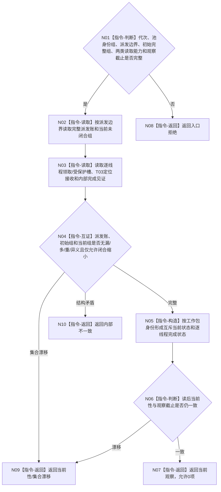

# BIZ-L4-001-13-02-01 读取冻结边界工作包与结果定位观察快照目标函数流程图 v0.1

更新时间：2026-08-27

## 依据

```text
0050、8100 v0.8、8110 v0.3；BIZ-L1-T04 v0.3；BIZ-L2-001-12；BIZ-L3-001-13-02；BIZ-L2-004-07
```

## 身份与边界

正式目标函数设计图。按 001-12 不可逆派发边界重读完整派发账、T04 领取/受保护槽、T03 工作结果定位接收见证和 T04 内部完成见证，形成一个当前观察。它不重做动作、不推进任务状态，也不把完成消息或本地回执解释为结果定位已交付。

## 函数合同

```text
根函数：读取冻结边界工作包与结果定位观察快照
归属模块 / 文件 / 目标分解深度：任务工作线程池 / 海中鱼巣/线程/任务工作线程池.ixx / BIZ-L4
现有或待新增：待新增；目标线程池和统一工作包账尚未实现
完整签名：冻结工作边界观察结果 读取冻结边界工作包与结果定位观察快照(const 冻结工作边界观察请求& 请求) const noexcept
参数：请求为只读借用；含运行代次、线程池租约只读身份组、派发门版本、最后派发序号、001-12初始完整当前在途组、T04保护槽读取能力、T03定位接收读取能力和观察截止
返回结果：不可变值式结果；成功含规范有序逐工作包未领取/处理中/定位已交付/受保护待恢复状态、逐线程完成状态和本次观察截止；非成功含入口拒绝、错代、当前性漂移、漏/多/重/异义、资源失败或内部不一致
被调函数流程图：无；同截止多源读取、逐项双射和纯值状态裁定为本函数内指令
父图：BIZ-L3-001-13-02
```

## 流程图



## 节点合同

| 节点 | 类型 | 输入 | 输出 | 事实读写 | 验证 |
| --- | --- | --- | --- | --- | --- |
| N01—N03 | 判断 / 读取 | 派发边界和读取能力 | 同观察多源材料 | 只读线程/派发/定位状态 | 0项、结果定位晚到、线程故障、受保护槽 |
| N04—N05 | 互证 / 构造 | 初始与当前材料 | 双射状态组 | 无写入 | 只缩小、漏/多/重/异义、完成消息不冒充定位 |
| N06—N10 | 判断 / 返回 | 观察截止 | 成功或结构化非成功 | 无写入 | 读前/读后漂移和空载荷 |

## 关键边界

- 初始完整当前在途组来自 001-12；本函数按同一派发边界重读，允许其中工作因定位交付而退出当前组，禁止出现边界外新工作或无见证消失。
- 结果定位已交付只证明 T03 已接收同一不可变定位；T03 尚未处理不阻止 T04 线程收口，后继处理由 001-14 负责。
- 受保护槽没有专属 owner 的可读恢复见证时保持“待恢复”，不得由快照函数把它改判为已闭合。
