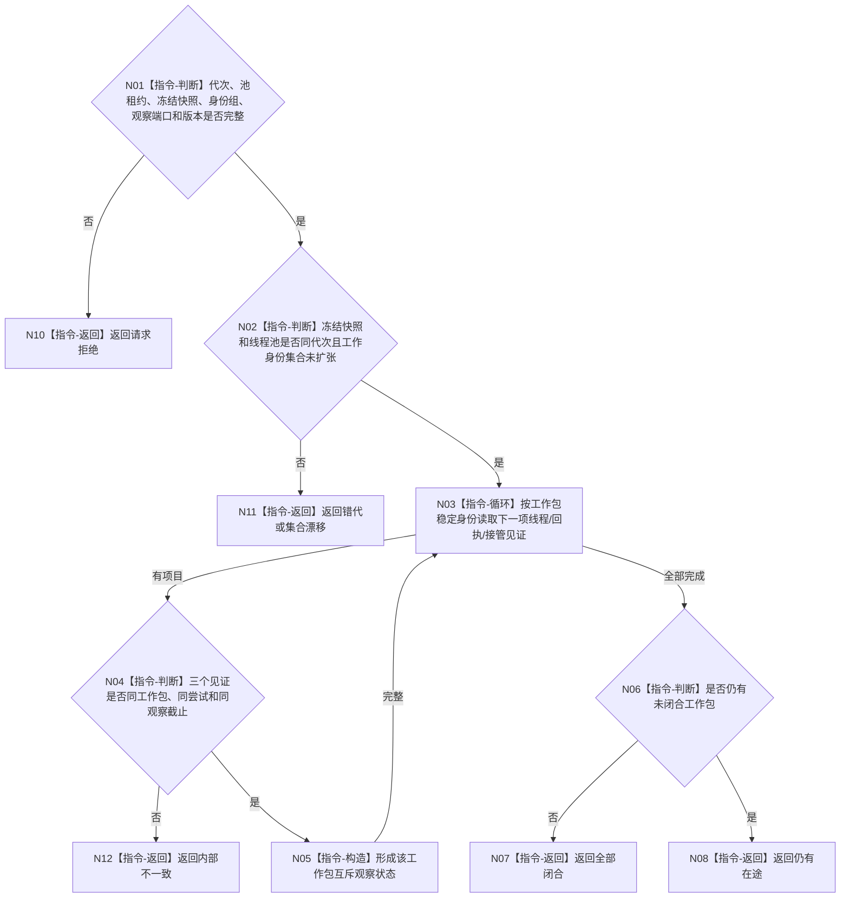

# BIZ-L4-001-13-02-01 读取冻结集合的工作包回执观察快照目标函数流程图 v0.1

更新时间：2026-08-03

## 依据

```text
8100、8110；BIZ-L3-001-13-02；BIZ-L2-004-07—08
```

## 身份与边界

正式目标函数设计图。对派发冻结时已有的工作包逐项读取工作线程见证、共享回执状态和停机接管状态，形成同一观察版本的值式快照；不重做动作、不推进任务状态。

## 函数合同

```text
根函数：读取冻结集合的工作包回执观察快照
归属模块 / 文件 / 层级：任务工作线程池 / 海中鱼巣/线程/任务工作线程池.ixx / L4
现有或待新增：待新增；组合工作包队列、在途账、回执队列和线程完成见证的只读投影
完整签名：冻结工作集合观察结果 读取冻结集合的工作包回执观察快照(const 冻结工作集合观察请求& 请求)
参数：请求为只读借用；含运行代次、线程池租约、冻结在途快照身份、工作包身份组、共享回执观察端口、接管观察端口和事实截止版本；借用覆盖调用
返回结果：不可变值式结果；含已读取、全部闭合、仍有在途、请求拒绝、错代、集合漂移或内部不一致，以及逐工作包未开始/执行中/回执已发布/接管已冻结/线程故障状态和观察版本
被调函数流程图：无；多个线程本地投影在固定截止版本下复制后联合复核
父图：BIZ-L3-001-13-02
```

## 流程图



## 节点合同

| 节点 | 类型 | 参数 / 输入绑定 | 结果 / 输出绑定 | 事实读写 | 后继条件 | 验证 |
| --- | --- | --- | --- | --- | --- | --- |
| N02/N03 | 指令 | 冻结集合和观察端口 | 单项见证组 | 只读线程/队列状态 | 集合不扩张 | 新派发必须已冻结 |
| N04/N05 | 指令 | 三类同项见证 | 互斥单项状态 | 无业务写入 | 同尝试同截止 | 回执与接管双记、未知身份 |

## 关键边界

回执已发布只证明工作线程上报完成，不证明任务状态已由任务管理线程正式提交。线程故障也不自动等于任务失败。

