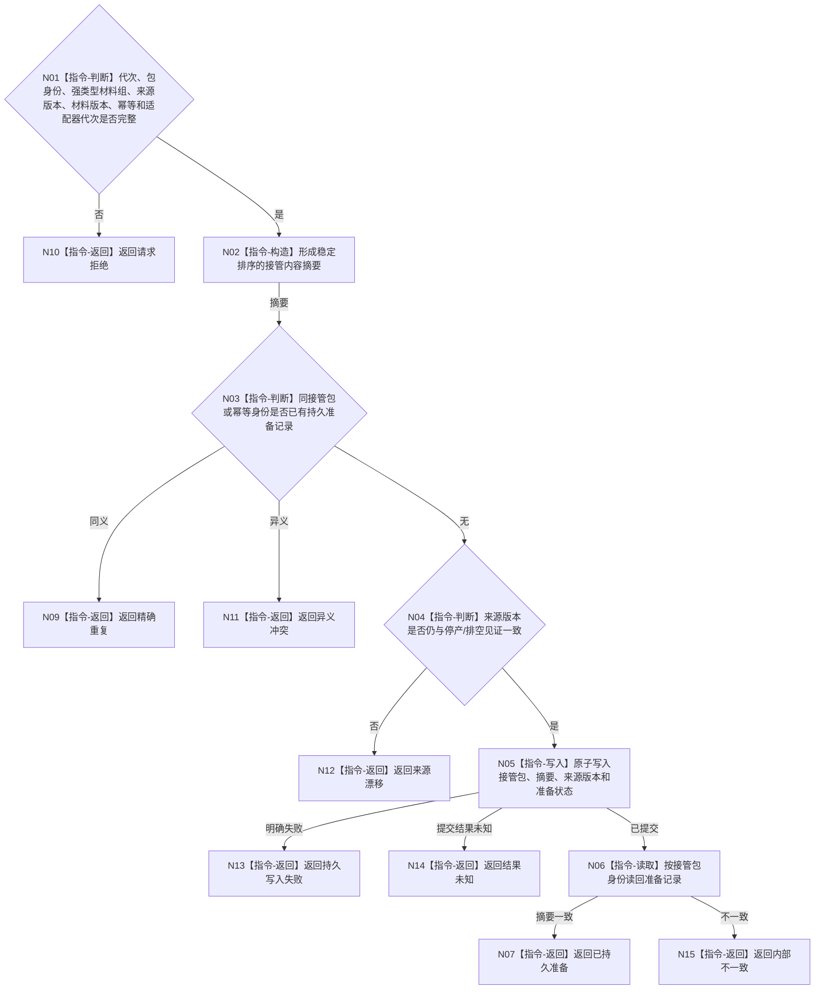

# BIZ-L4-001-13-03-01 持久准备剩余材料接管候选目标函数流程图 v0.1

更新时间：2026-08-03

## 依据

```text
0050、6340、8100；BIZ-L3-001-13-03
```

## 身份与边界

正式目标函数设计图。把未完成工作、未发布回执和停产截止内未收束报告写成可持久读回的恢复候选；候选不是任务结果、报告承接或世界事实，也不从来源队列删除材料。

## 函数合同

```text
根函数：剩余材料接管端口::持久准备接管候选
归属模块 / 文件 / 层级：剩余材料接管 / 海中鱼巣/适配/剩余材料接管端口.ixx / L4
现有或待新增：待新增；持久介质由适配器实现，接口冻结幂等、摘要和结果未知合同
完整签名：剩余材料接管准备结果 剩余材料接管端口::持久准备接管候选(const 剩余材料接管准备请求& 请求)
参数：请求为只读借用；含运行代次、接管包稳定身份、已登记强类型剩余材料组（可含工作包、回执、报告、治理消息、结算引用或支持旁路材料）、来源版本组、材料版本、幂等身份和持久适配器代次；端口所有者覆盖调用
返回结果：不可变值式结果；含已持久准备、精确重复、请求拒绝、异义冲突、来源漂移、持久写入失败、结果未知或内部不一致，以及准备版本、内容摘要和恢复定位身份
被调函数流程图：无；适配器事务细节由后续详细设计冻结，本图只冻结外部原子可见合同
父图：BIZ-L3-001-13-03
```

## 流程图



## 节点合同

| 节点 | 类型 | 参数 / 输入绑定 | 结果 / 输出绑定 | 事实读写 | 后继条件 | 验证 |
| --- | --- | --- | --- | --- | --- | --- |
| N02/N03 | 指令 | 不可变材料和幂等 | 摘要/复用裁决 | 只读既有接管记录 | 同义或无记录 | 排序稳定和异义重复 |
| N04/N05 | 指令 | 来源版本和接管包 | 持久准备记录 | 写恢复材料，不写业务事实 | 版本当前 | 断电和部分写入 |
| N06/N07 | 指令 | 接管身份 | 读回见证 | 只读准备记录 | 摘要一致 | 写后读回 |

## 关键边界

结果未知不得通过生成新身份重试；必须以原接管包和幂等身份读回裁决。只有持久准备读回完整后，线程连接阶段才可继续。
