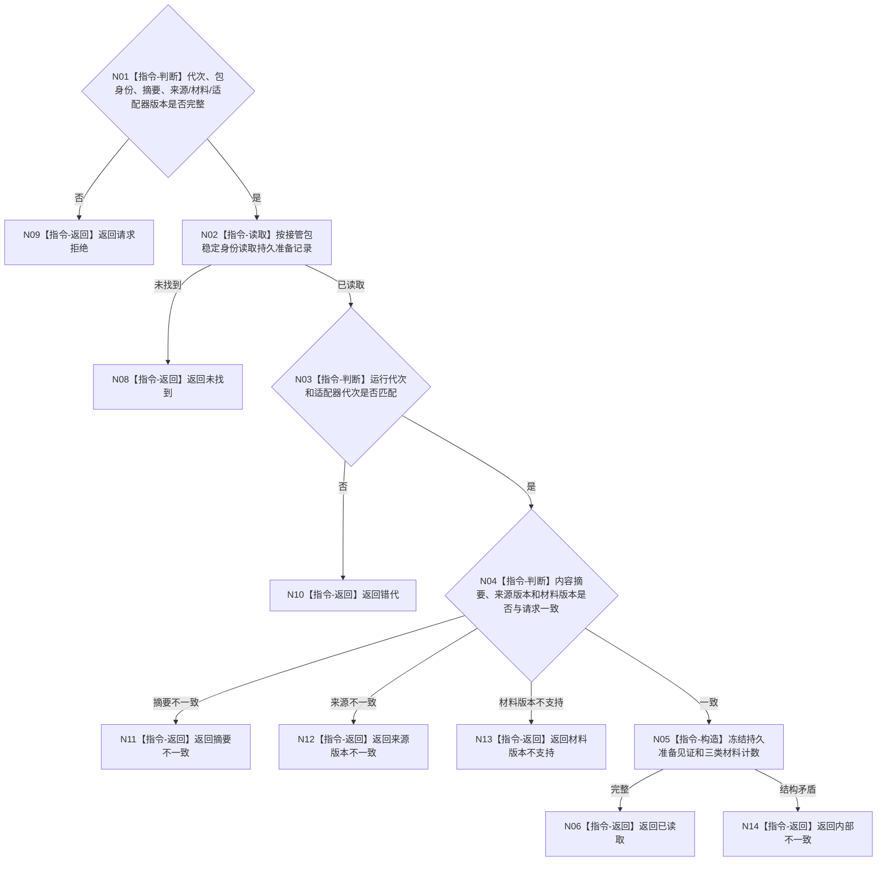

# BIZ-L4-001-13-03-02 读取已持久准备接管候选目标函数流程图 v0.1

更新时间：2026-08-03

## 依据

```text
0050、6340、8100；BIZ-L3-001-13-03；BIZ-L4-001-13-03-01
```

## 身份与边界

正式目标函数设计图。按稳定身份读取持久准备态并核对内容摘要、来源版本和材料分类；不恢复、不发布、不删除来源材料。

## 函数合同

```text
根函数：剩余材料接管端口::读取已持久准备接管候选
归属模块 / 文件 / 层级：剩余材料接管 / 海中鱼巣/适配/剩余材料接管端口.ixx / L4
现有或待新增：待新增
完整签名：剩余材料接管读回结果 剩余材料接管端口::读取已持久准备接管候选(const 剩余材料接管读回请求& 请求) const
参数：请求为只读借用；含运行代次、接管包稳定身份、期望摘要、来源版本组、材料版本和持久适配器代次；端口所有者覆盖调用
返回结果：不可变值式结果；含已读取、未找到、请求拒绝、错代、摘要不一致、来源版本不一致、材料版本不支持或内部不一致，以及持久准备见证和各已登记材料类别计数
被调函数流程图：无；按稳定键读取和纯值一致性复核为本函数内指令
父图：BIZ-L3-001-13-03
```

## 流程图



## 节点合同

| 节点 | 类型 | 参数 / 输入绑定 | 结果 / 输出绑定 | 事实读写 | 后继条件 | 验证 |
| --- | --- | --- | --- | --- | --- | --- |
| N02/N03 | 指令 | 稳定身份和代次 | 准备记录 | 只读持久恢复材料 | 记录当前 | 缺失和旧适配器代次 |
| N04/N05 | 指令 | 期望合同 | 持久准备见证 | 无写入 | 全字段一致 | 摘要、来源和分类计数 |

## 关键边界

读回成功只证明恢复候选可定位且内容完整，不证明恢复已经执行，也不证明其中工作或报告已经成为正式业务事实。
