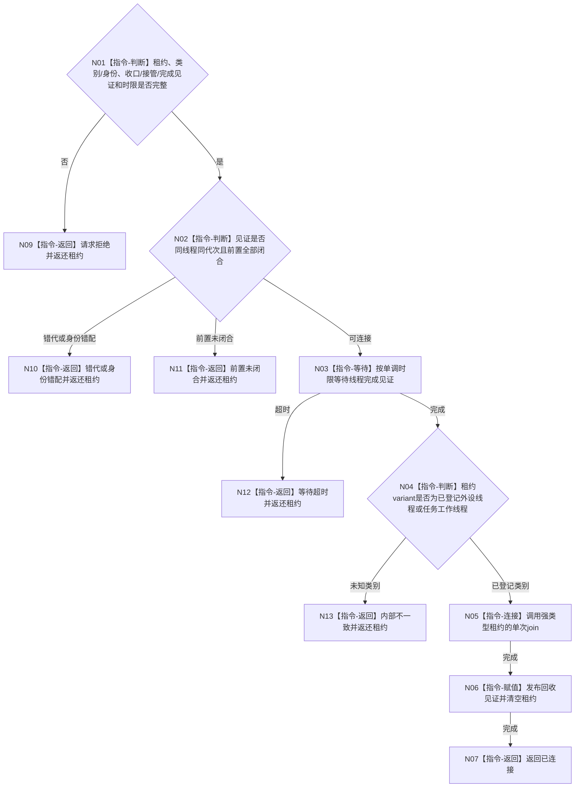

# BIZ-L4-001-13-04-01 连接一个已收口生产线程目标函数流程图 v0.1

更新时间：2026-08-03

## 依据

```text
6340、8100、8110；BIZ-L3-001-13-04
```

## 身份与边界

正式目标函数设计图。按强类型线程租约连接一个已经停产/排空并完成剩余材料持久准备的外设或任务工作线程；不以 `join` 推导业务结果。

## 函数合同

```text
根函数：连接一个已收口生产线程
归属模块 / 文件 / 层级：分阶段停止协调 / 海中鱼巣/启动.分阶段停止.ixx / L4
现有或待新增：待新增；统一两类强类型线程租约的完成见证和连接合同
完整签名：已收口生产线程连接结果 连接一个已收口生产线程(在途生产线程租约&& 线程租约, const 已收口生产线程连接请求& 请求) noexcept
参数：线程租约为外设线程或任务工作线程的唯一移动variant；请求为只读借用，含运行代次、线程类别/逻辑身份、停产或排空见证、剩余材料持久准备见证、线程完成见证和非零单调最长等待
返回结果：移动值式结果；含已连接、请求拒绝、错代、身份错配、前置未闭合、等待超时或内部不一致；所有未连接结果返还原强类型租约
被调函数流程图：无；variant穷尽、完成等待、join和租约清空为本函数内指令
父图：BIZ-L3-001-13-04
```

## 流程图



## 节点合同

| 节点 | 类型 | 参数 / 输入绑定 | 结果 / 输出绑定 | 事实读写 | 后继条件 | 验证 |
| --- | --- | --- | --- | --- | --- | --- |
| N02 | 指令-判断 | 收口和接管见证 | 连接资格 | 只读 | 全前置闭合 | 工作/报告剩余未持久阻断 |
| N03/N04 | 指令 | 完成见证和variant | 线程类别 | 无 | 已完成且类别已登记 | 超时和未知variant |
| N05/N06 | 指令 | 唯一租约 | 连接和回收见证 | 释放线程资源 | 单次join | 双join、detach和租约丢失 |

## 关键边界

外设与工作线程共用连接协议，不共用业务语义。线程类别只能由强类型variant表达，不得由名称、系统线程ID或空字段猜测。

