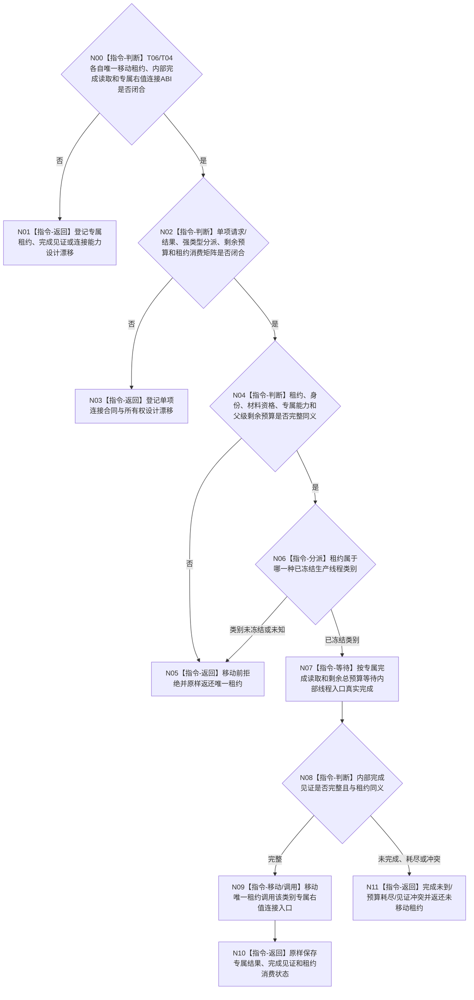

# BIZ-L4-001-13-04-01 连接一个已收口生产线程目标函数流程图 v0.2

更新时间：2026-08-28

## 依据

```text
0050、6340 v0.6、8100 v0.7、8110 v0.3、8120 v0.10；BIZ-L3-001-13-03/04 v0.2；
HEAD外设启动/收口与任务工作线程代码。
```

## 身份与边界

正式目标治理图。本叶目标是消费一份业务材料资格已经成立的唯一生产线程租约，按该线程类别的正式能力等待内部完成，并在完成后调用专属右值连接入口。材料资格只作为移动前准入；本叶不读取或裁决报告、工作包、动作后槽和结果定位。

旧v0.1假定T06/T04已经共享一个`在途生产线程租约`variant、统一完成读取能力和统一join协议。现行规范与HEAD均没有这些类型：T06无真实线程租约，T04对象不可移动且只有无时限join；8110只提供非权威投影。后继必须先分别冻结两类租约、内部完成生产点/正式读取和右值连接结果，再决定是否能够在本叶用强类型variant穷尽组合。

## 函数合同

```text
根函数候选：连接一个已收口生产线程
归属模块 / 文件 / 目标分解深度：生产线程单项连接 / 物理文件待两类专属连接ABI裁决 / BIZ-L4
现有或待新增：HEAD无T06连接能力；T04仅对象内无时限join，均无唯一移动租约
完整签名：未冻结；旧v0.1的在途生产线程租约variant、连接请求/结果不构成ABI
参数：未冻结；必须绑定单项唯一租约、同身份13-03材料资格、专属完成读取/右值连接能力和父级剩余总预算
返回结果：未冻结；移动前拒绝须返还原租约，移动后必须原样保存专属消费状态/完成见证/资源结果，不能伪造同一租约回生
被调函数流程图：无；合同闭合后只做强类型分派并调用专属右值入口
父图：BIZ-L3-001-13-04 v0.2
```

## 设计门禁与目标骨架



## 节点合同

| 节点 | 当前可确认合同 | 仍待冻结 | 验证边界 |
| --- | --- | --- | --- |
| N00/N01 | 每类线程必须先有唯一移动租约与专属连接owner | T06/T04租约、完成provider、右值入口和结果 | 不能从std::thread成员、对象地址或线程ID补造租约 |
| N02/N03 | 移动前/移动后失败和租约消费状态必须分账 | 请求/结果、variant、预算、异常与返回所有权布局 | 资源失败、能力缺失、内部矛盾和专属结果未知 |
| N04—N06 | 材料资格、身份和预算全部在移动前复核；未知类别不得消费租约 | 单项资格ABI、类别集合和同义公式 | 错代、错身份、资格不足、重复租约、坏预算 |
| N07/N08 | 内部完成必须来自线程入口实际结束后的专属见证 | 生产点、读取、伪唤醒、异常退出和当前性 | 8110已退出投影、joinable和日志均不能替代 |
| N09—N11 | 只有完成见证成立才移动调用；未移动非成功返还原租约 | 专属右值消费语义和单次连接结果 | 双join、连接异常、预算耗尽和租约守恒 |

## 当前代码对应（HEAD `b53e0b76`）

- T06没有线程对象、租约、内部完成见证或连接函数；外设收口为空壳。
- T04直接在不可移动对象内持有`std::thread`，`收口等待()`无时限join；没有完成见证读取、右值消费或未连接租约返还。
- 8110只承载非权威生命周期消息，不能升级为内部完成或资源连接事实。

## 具名偏差

1. `DRIFT-BIZ-T06-T04-PRODUCTION-THREAD-LEASE-VARIANT-OWNER-AND-RIGHT-VALUE-CONNECTION-ABI-UNFROZEN`
2. `DRIFT-BIZ-T06-T04-INTERNAL-COMPLETION-WITNESS-PRODUCER-READBACK-AND-TERMINAL-MATRIX-UNFROZEN`
3. `DRIFT-BIZ-T01-PRODUCTION-THREAD-CONNECTION-TOTAL-BUDGET-PARTIAL-RESULT-AND-UNCONNECTED-LEASE-RETURN-MATRIX-UNFROZEN`

## v0.2校正记录

- 撤销旧v0.1的统一租约variant、具体签名、完成读取能力和完整状态矩阵。
- 把单项顺序固定为“移动前资格复核—专属完成等待—右值连接—原样保存消费结果”。
- 明确两类专属合同必须先闭合，不能先造通用variant或用8110投影/无时限join补齐。
