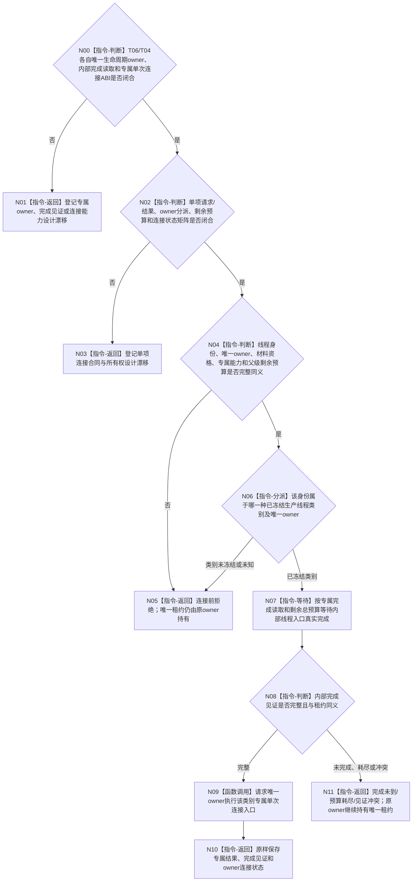

# BIZ-L4-001-13-04-01 连接一个已收口生产线程目标函数流程图 v0.3

更新时间：2026-08-28

## 依据

```text
0050、6340 v0.6、8100 v0.7、8110 v0.3、8120 v0.10；BIZ-L3-001-13-03 v0.2、BIZ-L3-001-13-04 v0.3；
当前已发布外设启动/收口与任务工作线程代码。
```

## 身份与边界

正式目标治理图。本叶目标是对一份业务材料资格已经成立的生产线程身份，调用该身份唯一生命周期owner的正式能力等待内部完成，并在完成后执行单次连接。材料资格只作为连接前准入；本叶不读取或裁决报告、工作包、动作后槽和结果定位。

旧v0.1假定T06/T04已经共享一个`在途生产线程租约`variant、统一完成读取能力和统一join协议。现行规范与HEAD均没有这些类型：T06无真实线程owner，T04对象不可移动且只有无时限join；8110只提供非权威投影。后继必须先分别冻结两类生命周期owner、内部完成生产点/正式读取和单次连接结果；组合层不得反向要求它们改造成统一variant或右值租约。

## 函数合同

```text
根函数候选：连接一个已收口生产线程
归属模块 / 文件 / 目标分解深度：生产线程单项连接 / 物理文件待两类专属生命周期owner与连接ABI裁决 / BIZ-L4
现有或待新增：HEAD无T06连接能力；T04仅在不可移动对象内无时限join
完整签名：未冻结；旧v0.1的在途生产线程租约variant、连接请求/结果不构成ABI
参数：未冻结；必须绑定单项线程稳定身份、同身份13-03材料资格、唯一生命周期owner的完成读取/单次连接能力和父级剩余总预算
返回结果：未冻结；连接前非成功不改变owner；调用后必须原样保存owner连接状态、完成见证和资源结果，不能让同一租约再次join
被调函数流程图：无；合同闭合后只做强类型owner分派并调用专属连接入口
父图：BIZ-L3-001-13-04 v0.3
```

## 设计门禁与目标骨架



## 节点合同

| 节点 | 当前可确认合同 | 仍待冻结 | 验证边界 |
| --- | --- | --- | --- |
| N00/N01 | 每类线程必须先有唯一生命周期owner与专属连接能力；唯一租约可以由owner原位持有 | T06/T04 owner、完成provider、连接入口和结果 | 不能从std::thread成员、对象地址或线程ID补造owner身份 |
| N02/N03 | 调用前/调用后失败和owner连接状态必须分账 | 请求/结果、owner分派、预算、异常与所有权布局 | 资源失败、能力缺失、内部矛盾和专属结果未知 |
| N04—N06 | 材料资格、身份和预算全部在调用前复核；未知类别不得调用owner连接 | 单项资格ABI、类别集合和同义公式 | 错代、错身份、资格不足、重复owner、坏预算 |
| N07/N08 | 内部完成必须来自线程入口实际结束后的专属见证 | 生产点、读取、伪唤醒、异常退出和当前性 | 8110已退出投影、joinable和日志均不能替代 |
| N09—N11 | 只有完成见证成立才调用唯一owner连接；非成功保持原owner与租约 | 专属单次连接语义和结果 | 双join、连接异常、预算耗尽和租约守恒 |

## 当前已发布代码对应（`28125acb`；相关源码自`b53e0b76`后未变）

- T06没有线程对象、租约、内部完成见证或连接函数；外设收口为空壳。
- T04直接在不可移动对象内持有`std::thread`，`收口等待()`无时限join；没有完成见证读取、诊断预算或owner范围的结构化连接状态。
- 8110只承载非权威生命周期消息，不能升级为内部完成或资源连接事实。

## 具名偏差

1. `DRIFT-BIZ-T06-T04-PRODUCTION-THREAD-LIFECYCLE-OWNER-AND-CONNECTION-ABI-UNFROZEN`
2. `DRIFT-BIZ-T06-T04-INTERNAL-COMPLETION-WITNESS-PRODUCER-READBACK-AND-TERMINAL-MATRIX-UNFROZEN`
3. `DRIFT-BIZ-T01-PRODUCTION-THREAD-CONNECTION-TOTAL-BUDGET-PARTIAL-RESULT-AND-UNCONNECTED-LEASE-RETURN-MATRIX-UNFROZEN`

## v0.2校正记录

- 撤销旧v0.1的统一租约variant、具体签名、完成读取能力和完整状态矩阵。
- 把单项顺序固定为“移动前资格复核—专属完成等待—右值连接—原样保存消费结果”。
- 明确两类专属合同必须先闭合，不能先造通用variant或用8110投影/无时限join补齐。

## v0.3校正记录

- 撤销右值移动租约作为T06/T04共同连接前提；8120只对自我线程启动候选冻结唯一租约、完成见证、join和禁止detach，不能据此要求T06/T04跨owner转移对象。
- 单项连接改为按稳定身份调用唯一生命周期owner；连接前失败不改变owner，连接后由owner锁存单次结果并禁止再次join。
