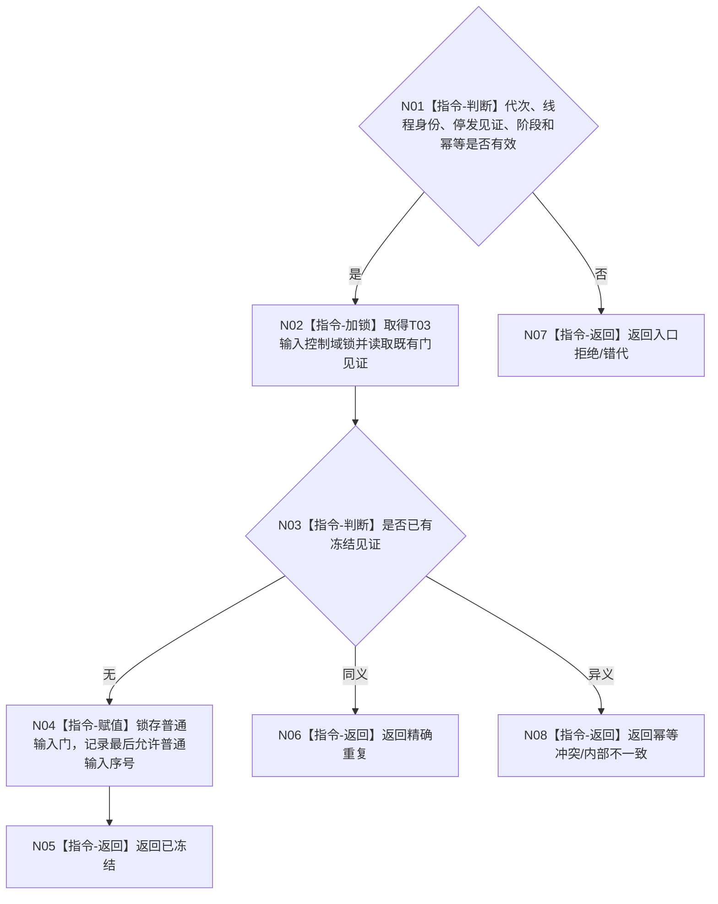

# BIZ-L4-001-14-01-01 冻结任务管理新普通输入门目标函数流程图 v0.1

更新时间：2026-08-26

## 依据

```text
0050、8100、8110；BIZ-L3-001-14-01、BIZ-L2-001-12、BIZ-L1-T03 v0.5
```

## 身份与边界

正式目标函数设计图。在 T03 控制域内原子冻结新的普通任务治理输入，保留停止消息、已接受工作回执、轮次结算定位发布及既有 self 后继决议的完成处理。工作包派发门已经由 BIZ-L2-001-12 冻结，本函数只校验其见证，不重复写门。

## 函数合同

```text
根函数：冻结任务管理新普通输入门
归属模块 / 文件 / 目标分解深度：任务管理线程控制域 / 海中鱼巣/线程/任务管理线程.ixx / BIZ-L4
现有或待新增：待新增；适配现有请求停止新派发能力并补普通治理输入门
完整签名：任务管理普通输入门冻结结果 冻结任务管理新普通输入门(const 任务管理普通输入门冻结请求& 请求) noexcept
参数：请求含运行代次、任务管理逻辑身份、001-12停发见证、停止阶段和幂等身份
返回结果：不可变值式结果；含已冻结、精确重复、入口拒绝、错代、幂等冲突或内部不一致，以及最后允许普通输入序号
被调函数流程图：无；控制域加锁、比较、锁存和见证读取均为本函数内指令
父图：BIZ-L3-001-14-01
```

## 流程图



## 节点合同

| 节点 | 类型 | 参数 / 输入绑定 | 结果 / 输出绑定 | 事实读写 | 验证 |
| --- | --- | --- | --- | --- | --- |
| N01—N03 | 判断/读取 | 停发和幂等材料 | 既有门状态 | 只读控制域 | 同义/异义重复 |
| N04 | 赋值 | 停止阶段 | 最后允许普通输入序号 | 原子冻结普通治理输入门；派发门只读互证 | 并发普通入队、既有派发门见证 |
| N05—N08 | 返回 | 门状态 | 结构化结果 | 不清空已接受材料 | 错代、冲突 |

## 关键边界

冻结后仍必须允许处理停机前已接受的工作回执、任务轮次收束及其到 T02 的定位；不得把队列清空当成排空，也不得重复改写001-12已经锁存的派发边界。
