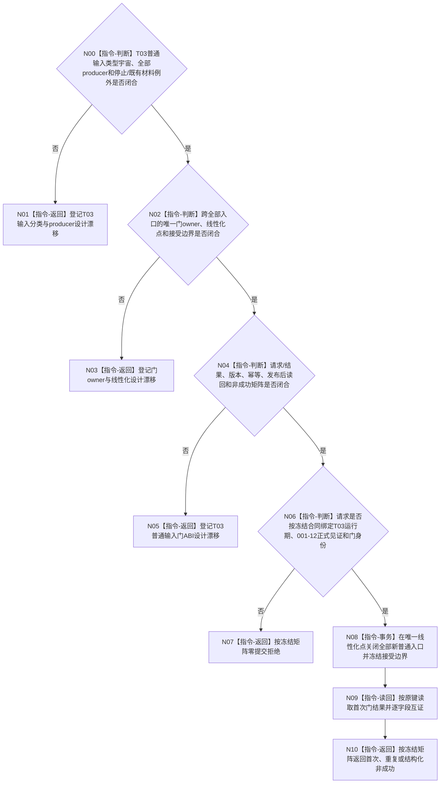

# BIZ-L4-001-14-01-01 冻结任务管理新普通输入门目标函数流程图 v0.2

更新时间：2026-08-28

## 依据

```text
0050、8100 v0.7、8110 v0.3；BIZ-L3-001-14-01 v0.2、BIZ-L2-001-12 v0.2；
BIZ-L1-T03 v0.5；发布源码任务管理线程与运行包代码。
```

## 身份与边界

正式目标治理图。本叶目标是在T03控制域内线性化关闭所有新普通任务治理输入，同时允许停止类输入以及冻结边界内已接受材料所必需的回执、定位和反向交付继续完成。它不清空业务队列、不裁决任务事实，也不重复改写001-12未来正式停派边界。

旧v0.1假定一个锁、一个停止阶段和一个序号即可覆盖T03普通输入。发布源码实际存在强类型执行请求、结果回执、重筹办意图和旧运行消息等不同入口与锁；正式材料尚未冻结哪些属于普通输入、各自producer、停止和边界内完成交付如何例外，以及一个门owner如何跨这些入口建立唯一线性化边界。现有`强类型请求停止锁存`只阻止一类预留，不能升级为本目标门。

## 函数合同

```text
根函数候选：冻结任务管理新普通输入门
归属模块 / 文件 / 目标分解深度：任务管理线程输入控制域 / 物理文件待输入门owner裁决 / BIZ-L4
现有或待新增：发布源码只有局部停止锁存；完整门不存在
完整签名：未冻结；旧任务管理普通输入门冻结请求/结果不构成ABI
参数：未冻结；必须绑定T03运行期、001-12正式停派读回、封闭入口边界、停止阶段和本门幂等身份
返回结果：未冻结；必须含本门首次提交/精确重复/入口拒绝/当前性或版本漂移/幂等冲突/资源失败/内部错误/已可能提交及正式读回
被调函数流程图：无；合同闭合后由本门owner协调各已冻结入口控制点
父图：BIZ-L3-001-14-01 v0.2
```

## 设计门禁与目标骨架



## 节点合同

| 节点 | 当前可确认合同 | 仍待冻结 | 验证边界 |
| --- | --- | --- | --- |
| N00/N01 | 普通输入必须按强类型入口和producer穷尽；边界内完成交付不能被误拒 | 类型集合、producer双射、停止与既有材料例外 | 新类型、未知producer、回执/定位晚到和停止并发 |
| N02/N03 | 一个正式门必须覆盖所有普通入口的接受判定，不能只锁一个队列 | owner、锁序/事务、接受序号或等价边界、恢复 | 多锁并发、门前已进入、门后新提交和异常恢复 |
| N04/N05 | 首次、重复、异义、漂移、资源/内部和已可能提交必须结构化并可读回 | ABI版本、请求/结果字段、状态数值、幂等与读回 | 同键异义、提交后读回失败、重试与当前性 |
| N06—N10 | 001-12只读互证，不由本门补造；入口拒绝必须零提交 | 001-12正式见证、门身份和成功公式 | 坏见证、错代、精确重复、首次和内部不一致 |

## 当前已发布代码对应（`0f4fa4b4`；相关源码自`d6ed3380`后未变）

- `任务管理线程::请求停止新派发()`只在`强类型请求队列锁`下设置`强类型请求停止锁存`。
- `发送任务执行请求()`、`提交任务结果回执()`、`提交任务重筹办意图()`和停止消息使用不同队列、状态与锁；没有封闭入口表或统一门读回。
- `排空结果上行并停止()`是最终停止相邻能力，不定义允许边界内producer继续交付的普通输入门。

## 具名偏差

1. `DRIFT-BIZ-T03-T02-ORDINARY-INPUT-CLOSED-UNIVERSE-PRODUCERS-AND-STOP-EXCEPTIONS-UNFROZEN`
2. `DRIFT-BIZ-T03-ORDINARY-INPUT-STOP-LINEARIZATION-OWNER-ABI-IDEMPOTENCY-AND-READBACK-MATRIX-UNFROZEN`

## v0.2校正记录

- 撤销旧v0.1的具体签名、单锁覆盖、最后允许序号和状态矩阵。
- 明确现有强类型派发停锁只是局部机械能力，不是全部普通输入门。
- 保留“门后拒绝新普通输入、门前既有材料继续完成、停止消息仍可进入”的目标方向。
