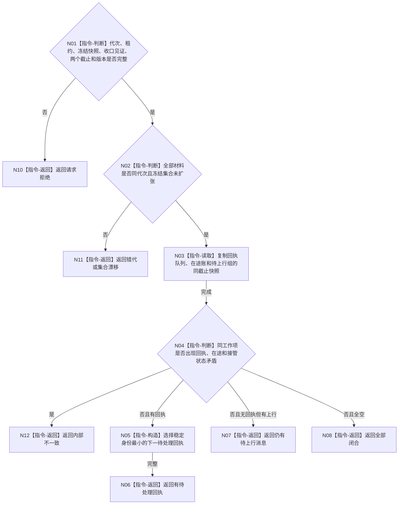

# BIZ-L4-001-14-01-01 读取任务管理排空进度目标函数流程图 v0.1

更新时间：2026-08-03

## 依据

```text
8100、8110；BIZ-L3-001-14-01；BIZ-L2-004-08—09
```

## 身份与边界

正式目标函数设计图。读取冻结边界内任务工作回执、任务管理在途账和待上行消息的收口进度；不处理回执、不推进任务状态。

## 函数合同

```text
根函数：读取任务管理排空进度
归属模块 / 文件 / 层级：任务管理线程 / 海中鱼巣/线程/任务管理线程.ixx / L4
现有或待新增：待新增；组合冻结在途账、工作结果队列和任务管理上行候选的只读投影
完整签名：任务管理排空进度读取结果 读取任务管理排空进度(const 任务管理排空进度读取请求& 请求)
参数：请求为只读借用；含运行代次、任务管理线程租约、冻结在途快照、生产者收口见证、回执截止身份、上行截止身份和事实截止版本；租约覆盖读取
返回结果：不可变值式结果；含有待处理回执、全部回执闭合、仍有待上行消息、全部闭合、请求拒绝、错代、集合漂移或内部不一致，以及下一回执身份、剩余身份组和观察版本
被调函数流程图：无；多投影复制、稳定排序和集合互证为本函数内只读指令
父图：BIZ-L3-001-14-01
```

## 流程图



## 节点合同

| 节点 | 类型 | 参数 / 输入绑定 | 结果 / 输出绑定 | 事实读写 | 后继条件 | 验证 |
| --- | --- | --- | --- | --- | --- | --- |
| N02/N03 | 指令 | 冻结边界与三个投影 | 同截止快照 | 只读 | 集合不扩张 | 新派发禁入和并发上行 |
| N04/N05 | 指令 | 工作项状态组 | 下一回执或收口状态 | 无业务写入 | 状态互斥 | 重复回执与双接管 |

## 关键边界

回执待处理和上行消息待提交必须分账；任务回执只有经 BIZ-L2-004-08 独立回读和正式提交后，才可能形成上行治理消息。
