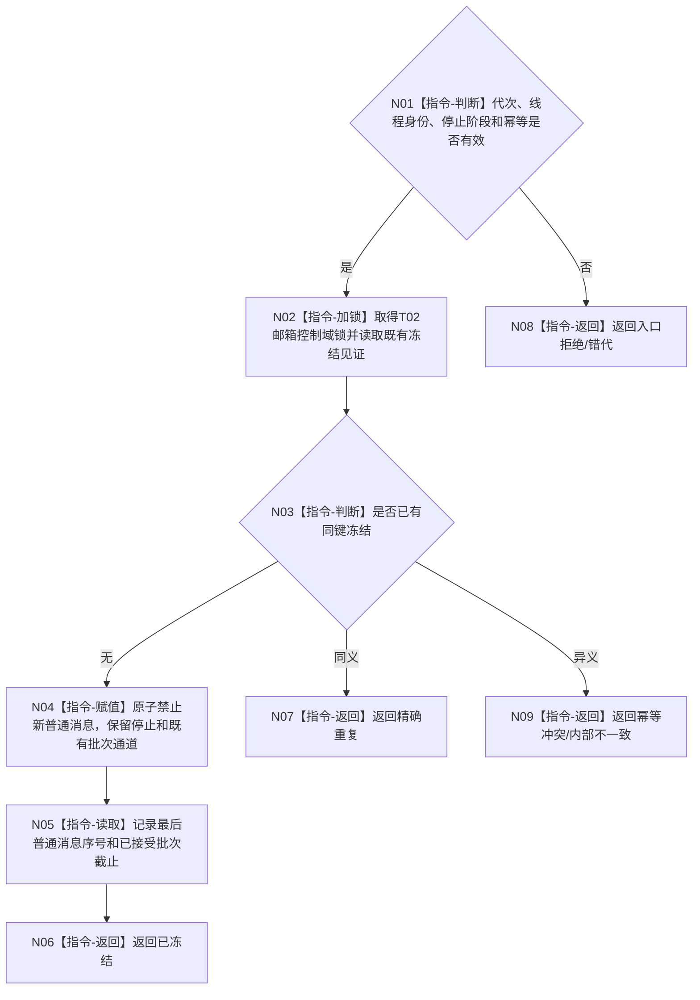

# BIZ-L4-001-14-01-02 冻结自我治理新普通输入门目标函数流程图 v0.1

更新时间：2026-08-26

## 依据

```text
0050、8100 v0.8、8110；BIZ-L3-001-14-01、BIZ-L1-T02
```

## 身份与边界

正式目标函数设计图。在 T02 邮箱控制域内冻结新的普通治理消息准入，保留停止类消息和停机前已接受的任务轮次结算定位处理；不得把消息优先级或队列长度改写为业务结论。

## 函数合同

```text
根函数：冻结自我治理新普通输入门
归属模块 / 文件 / 目标分解深度：自我线程邮箱控制域 / 海中鱼巣/线程/创建.自我线程.ixx / BIZ-L4
现有或待新增：待新增；复用有界邮箱停止/门控能力但不直接停止邮箱
完整签名：自我治理普通输入门冻结结果 冻结自我治理新普通输入门(const 自我治理普通输入门冻结请求& 请求) noexcept
参数：请求含运行代次、自我线程逻辑身份、停止阶段和幂等身份
返回结果：不可变值式结果；含已冻结、精确重复、入口拒绝、错代、幂等冲突或内部不一致，以及最后允许普通消息序号和已接受批次截止
被调函数流程图：无；邮箱控制域加锁、比较和门锁存为本函数内指令
父图：BIZ-L3-001-14-01
```

## 流程图



## 节点合同

| 节点 | 类型 | 参数 / 输入绑定 | 结果 / 输出绑定 | 事实读写 | 验证 |
| --- | --- | --- | --- | --- | --- |
| N01—N03 | 判断/读取 | 门冻结请求 | 既有门见证 | 只读邮箱控制域 | 同义/异义重放 |
| N04/N05 | 赋值/读取 | 停止阶段 | 序号和批次截止 | 只改普通输入门 | 并发普通/停止消息 |
| N06—N09 | 返回 | 门状态 | 结构化结果 | 不丢弃既有批次 | 错代、冲突 |

## 关键边界

本函数不是“停止自我线程”；它只冻结新普通输入。既有结算定位必须继续被 T02 消费并可能形成反向 self 后继决议。
