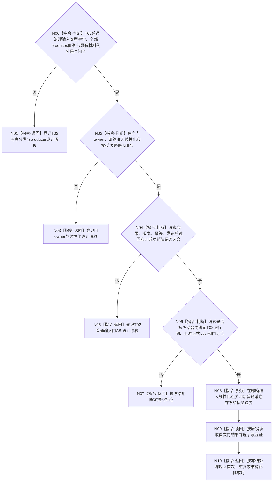

# BIZ-L4-001-14-01-02 冻结自我治理新普通输入门目标函数流程图 v0.2

更新时间：2026-08-28

## 依据

```text
0050、8100 v0.7、8110 v0.3；BIZ-L3-001-14-01 v0.2、BIZ-L2-001-12 v0.2；
BIZ-L1-T02 v0.6；HEAD自我治理消息、邮箱与自我线程代码。
```

## 身份与边界

正式目标治理图。本叶目标是在T02邮箱控制域关闭新普通治理输入，同时继续允许停止类输入和冻结边界内已接受材料产生的必需定位、完成交付及其既有处理槽恢复。它不删除邮箱材料、不裁决需求或任务，也不把邮箱停止、批次计数或8110线程投影冒充普通输入门。

旧v0.1假定现有有界邮箱可直接复用为“普通输入门”，并提前冻结停止阶段、幂等身份、最后普通消息序号和已接受批次截止。现行协议虽有具名消息类型和停止优先级，但没有冻结哪些类型在本阶段属于新普通输入、每类全部producer、哪些边界内后续交付必须例外放行，也没有独立门owner、版本、幂等账和正式读回。停止整个邮箱会拒绝必要的边界内交付，不能作为本目标实现。

## 函数合同

```text
根函数候选：冻结自我治理新普通输入门
归属模块 / 文件 / 目标分解深度：自我线程邮箱输入控制域 / 物理文件待输入门owner裁决 / BIZ-L4
现有或待新增：HEAD只有邮箱提交、冻结批次和邮箱停止相邻能力；完整门不存在
完整签名：未冻结；旧自我治理普通输入门冻结请求/结果不构成ABI
参数：未冻结；必须绑定T02运行期、001-12未来正式边界、封闭消息/producer边界、停止阶段和本门幂等身份
返回结果：未冻结；必须含本门首次提交/精确重复/入口拒绝/当前性或版本漂移/幂等冲突/资源失败/内部错误/已可能提交及正式读回
被调函数流程图：无；合同闭合后由本门owner在邮箱准入控制域线性化
父图：BIZ-L3-001-14-01 v0.2
```

## 设计门禁与目标骨架



## 节点合同

| 节点 | 当前可确认合同 | 仍待冻结 | 验证边界 |
| --- | --- | --- | --- |
| N00/N01 | 普通/停止/边界内完成交付必须按强类型消息及producer明确分类 | 消息集合、producer双射、例外和过渡期未知类型规则 | 九类现行消息、后继新增类型、停止混批和晚到定位 |
| N02/N03 | 门应在线性化准入时拒绝新普通消息，同时保留边界内例外与既有处理槽 | owner、锁序、接受序号或等价截止、恢复 | 门前并发提交、门后停止、冻结批次和私有槽重试 |
| N04/N05 | 邮箱计数/快照不是幂等账；首次与正式读回须有独立结构化合同 | ABI版本、请求/结果字段、状态、幂等和读回 | 精确重复、同键异义、提交后读回失败和资源失败 |
| N06—N10 | 入口拒绝零提交；不能从旧请求、首条消息或当前队列长度补造边界 | 上游见证、门身份和成功公式 | 错代、坏见证、首次、重复、漂移与内部不一致 |

## 当前代码对应（HEAD `d6ed3380`）

- HEAD有界自我治理邮箱支持提交、批次冻结和整体停止，现行协议区分九类强类型消息及停止优先级。
- 这些能力没有定义本停止阶段的普通输入封闭集合、全部producer和边界内例外；整体邮箱停止会使后续必要交付无法进入。
- HEAD没有独立普通输入门请求/结果、门幂等账、首次发布证据或正式读回入口。

## 具名偏差

1. `DRIFT-BIZ-T03-T02-ORDINARY-INPUT-CLOSED-UNIVERSE-PRODUCERS-AND-STOP-EXCEPTIONS-UNFROZEN`
2. `DRIFT-BIZ-T02-ORDINARY-GOVERNANCE-INPUT-STOP-LINEARIZATION-OWNER-ABI-IDEMPOTENCY-AND-READBACK-MATRIX-UNFROZEN`

## v0.2校正记录

- 撤销旧v0.1的具体签名、现有邮箱直接复用、最后消息序号/批次截止和状态矩阵。
- 明确邮箱整体停止、统计快照和8110投影都不能证明普通输入门。
- 保留“拒绝新普通输入，同时继续停止和边界内既有材料所需交付”的目标方向。
