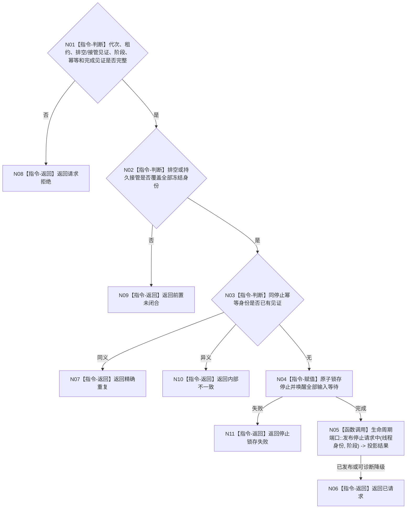

# BIZ-L4-001-14-01-02 请求任务管理线程停止目标函数流程图 v0.1

更新时间：2026-08-03

## 依据

```text
8100、8110；BIZ-L3-001-14-01
```

## 身份与边界

正式目标函数设计图。仅在冻结边界内回执已处理且剩余材料已持久准备后锁存任务管理线程停止；不连接线程、不清空输入源。

## 函数合同

```text
根函数：请求任务管理线程停止
归属模块 / 文件 / 层级：任务管理线程 / 海中鱼巣/线程/任务管理线程.ixx / L4
现有或待新增：适配扩展；复用当前停止锁存，补齐排空见证、阶段和幂等身份
完整签名：任务管理线程停止请求结果 请求任务管理线程停止(const 任务管理线程停止请求& 请求) noexcept
参数：请求为只读借用；含运行代次、任务管理线程租约身份、排空结果、可选剩余材料持久准备见证、停止阶段、停止幂等身份和完成见证；调用方继续持有线程租约
返回结果：不可变值式结果；含已请求、精确重复、请求拒绝、错代、前置未闭合、停止锁存失败或内部不一致，以及停止见证
被调函数流程图：无；原子锁存、唤醒三类输入等待和8110旁路发布为本函数内指令
父图：BIZ-L3-001-14-01
```

## 流程图



## 节点合同

| 节点 | 类型 | 参数 / 输入绑定 | 结果 / 输出绑定 | 事实读写 | 后继条件 | 验证 |
| --- | --- | --- | --- | --- | --- | --- |
| N02/N03 | 指令 | 排空/接管和幂等 | 停止资格 | 只读 | 全身份覆盖 | 剩余未持久和重复停止 |
| N04 | 指令-赋值 | 停止阶段 | 停止见证 | 只改线程运行状态 | 原子锁存 | 三输入源唤醒 |
| N05 | 函数调用 | 生命周期材料 | 投影结果 | 只写8110旁路 | 可诊断降级 | 投影失败不撤回停止 |

## 关键边界

停止请求不连接线程；连接统一由 BIZ-L3-001-14-04 执行。任务管理停止不等于所有上行治理消息已由自我线程处理。
