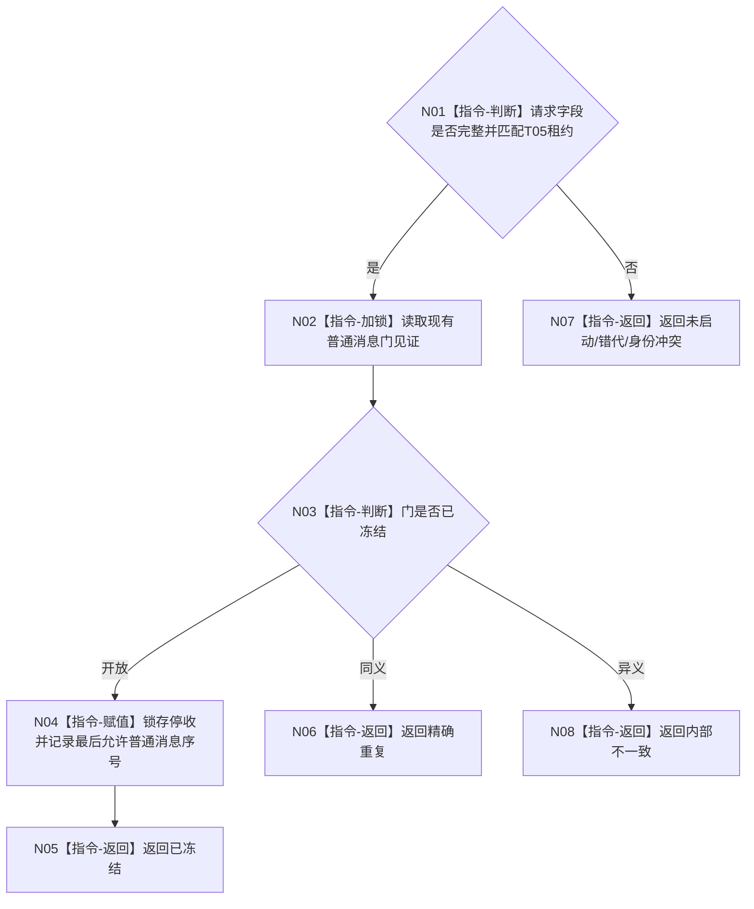

# BIZ-L4-001-14-02-01 冻结控制面板普通程序控制消息门目标函数流程图 v0.1

更新时间：2026-08-26

## 依据

```text
0050、8110、8120；BIZ-L3-001-14-02、BIZ-L1-T05
```

## 身份与边界

正式目标函数设计图。锁存 T05 的普通程序控制消息停收门，保留唯一退出请求和窗口生命周期消息；不关闭窗口、不等待线程完成。

## 函数合同

```text
根函数：冻结控制面板普通程序控制消息门
归属模块 / 文件 / 目标分解深度：控制面板线程控制域 / 海中鱼巣/控制面板/线程.控制面板.ixx / BIZ-L4
现有或待新增：待新增
完整签名：控制面板消息门冻结结果 冻结控制面板普通程序控制消息门(const 控制面板消息门冻结请求& 请求) noexcept
参数：请求含运行代次、控制面板逻辑身份、停止阶段和幂等身份
返回结果：不可变值式结果；含已冻结、精确重复、线程未启动、错代、身份冲突或内部不一致，以及最后允许普通消息序号
被调函数流程图：无；控制域内原子门锁存为本函数内指令
父图：BIZ-L3-001-14-02
```

## 流程图



## 关键边界

冻结普通控制消息后仍允许退出消息进入；不得因停收门成立就声称窗口或线程已经退出。
