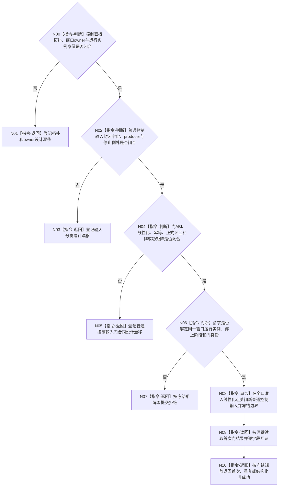

# BIZ-L4-001-14-02-01 冻结控制面板普通程序控制消息门目标函数流程图 v0.2

更新时间：2026-08-28

## 依据

```text
0050、8100 v0.7、8110 v0.3、8120 v0.10；BIZ-L3-001-14-02 v0.2、BIZ-L2-001-09 v0.2；
BIZ-L1-T05 v0.5；HEAD程序运行宿主与启动代码。
```

## 身份与边界

正式目标治理图。本叶目标是在线性化边界后拒绝控制面板新的普通控制输入，同时继续接受宿主停止、窗口关闭/销毁和门前已接受处理所必需的生命周期输入。它不关闭窗口、不等待消息循环终止，也不把8110投影或UI状态冒充门见证。

旧v0.1固定门位于独立T05线程控制域，并提前冻结了运行代次、逻辑线程身份、停止阶段、最后普通消息序号和完整状态。现行控制面板拓扑与窗口owner未裁决；主宿主方案的门属于宿主窗口循环，独立T05方案才可能属于线程控制域。现行正式材料也没有定义普通控制输入的封闭类型、全部producer和停止例外。HEAD没有窗口或控制输入入口可供直接适配。

## 函数合同

```text
根函数候选：冻结控制面板普通程序控制消息门
归属模块 / 文件 / 目标分解深度：控制面板窗口运行控制域 / 物理文件待拓扑与窗口owner裁决 / BIZ-L4
现有或待新增：HEAD无窗口、普通控制输入端口或本门
完整签名：未冻结；旧控制面板消息门冻结请求/结果不构成ABI
参数：未冻结；必须绑定所选拓扑、窗口运行实例、宿主停止阶段、封闭输入边界和本门幂等身份
返回结果：未冻结；必须含首次提交、精确重复、入口拒绝、实例/版本漂移、幂等冲突、资源失败、内部错误、已可能提交和正式读回
被调函数流程图：无；合同闭合后由窗口运行owner在线性化准入点锁存
父图：BIZ-L3-001-14-02 v0.2
```

## 设计门禁与目标骨架



## 节点合同

| 节点 | 当前可确认合同 | 仍待冻结 | 验证边界 |
| --- | --- | --- | --- |
| N00/N01 | 门归窗口运行owner，不由“线程”名称预设物理归属 | 主宿主/独立T05、窗口owner、实例与亲和 | 两种拓扑、实例更换、窗口未建立和已终止 |
| N02/N03 | 刷新/普通用户控制与宿主停止/关闭生命周期必须显式分类 | 输入集合、producer、例外和未知类型规则 | 普通输入并发、停止优先、销毁消息和门前处理 |
| N04/N05 | UI队列序号或8110投影不构成幂等账和正式读回 | ABI、状态、线性化、幂等、读回与恢复 | 首次、重复、同键异义、提交后读回失败 |
| N06—N10 | 错模式/实例/停止阶段在提交前拒绝；成功只证明门已关闭 | 模式读回、实例身份、门身份和成功公式 | 错实例、错代、漂移、资源和内部不一致 |

## 当前代码对应（HEAD `74bbcfec`）

- HEAD没有控制面板窗口模块、普通控制输入入口、窗口运行实例或门owner。
- `按模式启动控制面板线程()`只是返回bool的生命周期空壳；无法提供本门线性化候选。
- 8110当前投影和程序停止信号都不拥有控制面板普通输入准入。

## 具名偏差

1. `DRIFT-BIZ-CONTROL-PANEL-EXECUTION-TOPOLOGY-WINDOW-OWNER-AND-THREAD-AFFINITY-UNFROZEN`
2. `DRIFT-BIZ-T05-ORDINARY-CONTROL-INPUT-CLOSED-UNIVERSE-PRODUCERS-AND-STOP-EXCEPTIONS-UNFROZEN`
3. `DRIFT-BIZ-CONTROL-PANEL-ORDINARY-INPUT-GATE-OWNER-ABI-IDEMPOTENCY-AND-READBACK-MATRIX-UNFROZEN`

## v0.2校正记录

- 撤销独立T05归属、具体签名、最后普通消息序号和完整状态矩阵。
- 先冻结拓扑、窗口owner和输入分类，再决定门的物理位置与ABI。
- 明确门见证只证明普通输入已关闭，不证明窗口关闭、循环终止或线程完成。
