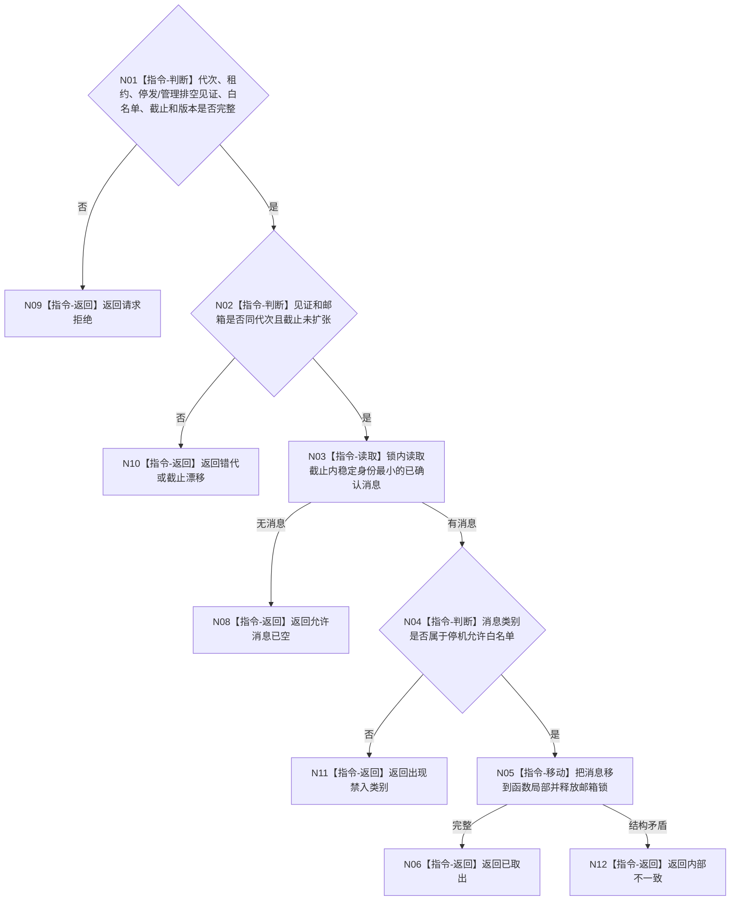

# BIZ-L4-001-14-02-01 读取允许类别内最终治理消息目标函数流程图 v0.1

更新时间：2026-08-03

## 依据

```text
0050、8100；BIZ-L3-001-14-02；BIZ-L2-002-01、BIZ-L2-004-14
```

## 身份与边界

正式目标函数设计图。只从停发边界前已确认的自我治理消息中取出一个允许停机收束的结果/结算类消息；新任务意图、重筹办和普通周期唤醒属于禁入。

## 函数合同

```text
根函数：读取允许类别内最终治理消息
归属模块 / 文件 / 层级：自我治理邮箱 / 海中鱼巣/线程/自我治理邮箱.ixx / L4
现有或待新增：待新增；复用治理批次冻结队列，增加停机允许类别白名单
完整签名：最终治理消息读取结果 读取允许类别内最终治理消息(const 最终治理消息读取请求& 请求)
参数：请求为只读借用；含运行代次、自我线程租约身份、停发见证、任务管理排空结果、允许类别集合、消息截止身份和观察版本；租约覆盖调用
返回结果：移动值式结果；含已取出、允许消息已空、出现禁入类别、请求拒绝、错代、截止漂移或内部不一致，以及不可变治理消息和剩余身份组
被调函数流程图：无；锁内稳定身份取出、类别复核和锁外值式返回为本函数内指令
父图：BIZ-L3-001-14-02
```

## 流程图



## 节点合同

| 节点 | 类型 | 参数 / 输入绑定 | 结果 / 输出绑定 | 事实读写 | 后继条件 | 验证 |
| --- | --- | --- | --- | --- | --- | --- |
| N02/N03 | 指令 | 停发截止和邮箱 | 下一消息 | 只移动队列项 | 截止不扩张 | 并发迟到消息 |
| N04/N05 | 指令 | 允许类别白名单 | 局部不可变消息 | 无业务写入 | 类别允许 | 新意图禁入和锁外处理 |

## 关键边界

禁入消息不能静默丢弃或在停机中执行，必须形成内部不一致或持久剩余材料，由恢复/诊断处理。
