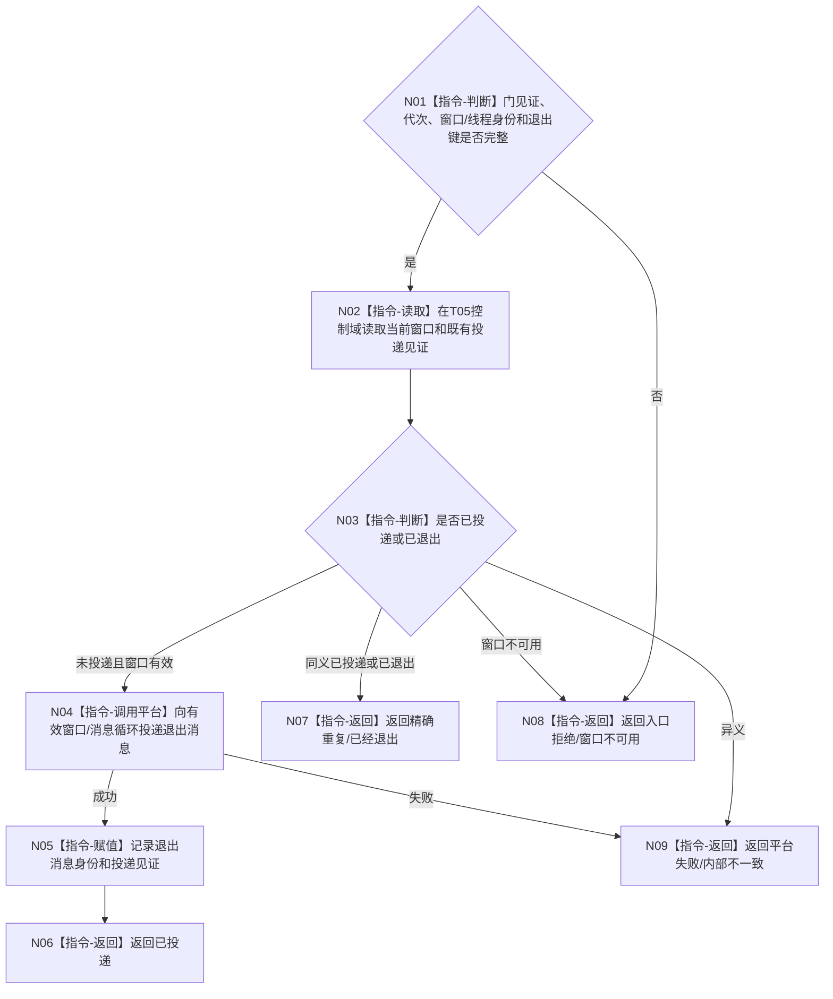

# BIZ-L4-001-14-02-02 向控制面板窗口投递退出请求目标函数流程图 v0.1

更新时间：2026-08-26

## 依据

```text
0050、8110、8120；BIZ-L3-001-14-02、BIZ-L4-001-14-02-01
```

## 身份与边界

正式目标函数设计图。普通消息门冻结后，向当前有效窗口或消息循环投递唯一退出请求并记录投递见证；窗口缺失、已退出和投递失败分账，不把投递成功冒充线程完成。

## 函数合同

```text
根函数：向控制面板窗口投递退出请求
归属模块 / 文件 / 目标分解深度：控制面板线程控制域 / 海中鱼巣/控制面板/线程.控制面板.ixx / BIZ-L4
现有或待新增：待新增
完整签名：控制面板退出请求投递结果 向控制面板窗口投递退出请求(const 控制面板退出请求& 请求) noexcept
参数：请求含运行代次、窗口/线程稳定身份、消息门冻结见证、停止来源、退出消息身份和幂等身份
返回结果：不可变值式结果；含已投递、精确重复、已经退出、窗口不可用、错代、身份冲突或平台失败，以及投递见证
被调函数流程图：无；窗口句柄读取、幂等比较和平台消息投递为本函数内指令
父图：BIZ-L3-001-14-02
```

## 流程图



## 关键边界

平台投递成功只证明退出请求进入窗口队列；线程完成必须由独立内部见证证明。
