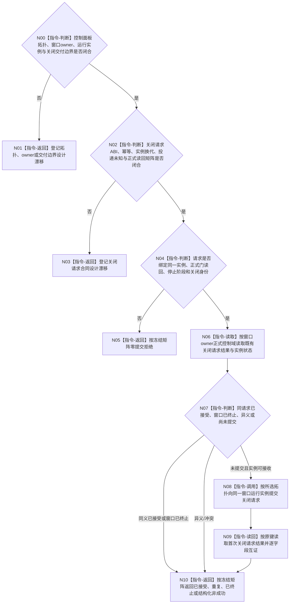

# BIZ-L4-001-14-02-02 向控制面板窗口投递退出请求目标函数流程图 v0.2

更新时间：2026-08-28

## 依据

```text
0050、8100 v0.7、8110 v0.3、8120 v0.10；BIZ-L3-001-14-02 v0.2、BIZ-L4-001-14-02-01 v0.2；
BIZ-L1-T05 v0.5；HEAD程序运行宿主与启动代码。
```

## 身份与边界

正式目标治理图。本叶目标是在普通控制输入门正式成立后，向同一窗口运行实例提交唯一关闭请求。提交已接受只证明请求进入所选窗口宿主的正式交付边界；窗口关闭、消息循环返回、独立物理线程完成和资源连接由后继各自证明。

旧v0.1固定窗口句柄、独立线程身份、平台消息投递和投递见证已经存在。现行拓扑、窗口owner与线程亲和未冻结，HEAD也没有窗口或消息循环。主宿主方案可以是本地宿主控制请求，独立T05方案才涉及跨线程交付；在方案确定前不能预选平台调用、窗口句柄或消息队列作为ABI。正式材料还缺关闭请求身份、幂等、投递未知、窗口已终止、实例换代和正式读回矩阵。

## 函数合同

```text
根函数候选：向控制面板窗口投递退出请求
归属模块 / 文件 / 目标分解深度：窗口运行宿主关闭请求交付 / 物理文件待拓扑与窗口owner裁决 / BIZ-L4
现有或待新增：HEAD无窗口、消息循环或关闭请求端口
完整签名：未冻结；旧控制面板退出请求/投递结果不构成ABI
参数：未冻结；必须绑定所选拓扑、窗口运行实例、普通输入门正式读回、宿主停止阶段、关闭请求身份和本入口幂等身份
返回结果：未冻结；必须分账已接受、精确重复、窗口已终止、入口拒绝、实例/版本漂移、幂等冲突、平台或资源失败、内部错误、投递未知/已可能提交及正式读回
被调函数流程图：无；平台或本地宿主适配只在拓扑合同闭合后确定
父图：BIZ-L3-001-14-02 v0.2
```

## 设计门禁与目标骨架



## 节点合同

| 节点 | 当前可确认合同 | 仍待冻结 | 验证边界 |
| --- | --- | --- | --- |
| N00/N01 | 关闭请求必须交给真实窗口运行owner；不能从句柄、线程ID或模式名补造owner | 拓扑、owner、实例身份、交付与生命周期边界 | 主宿主、独立T05、窗口未建/换代/已终止 |
| N02/N03 | 平台调用成功不自动等于正式已接受；未知提交必须按原键收束 | 请求/结果、幂等账、平台映射、已可能提交和读回 | 调用前失败、调用后未知、队列销毁和重复关闭 |
| N04/N05 | 门结果和停止阶段必须来自正式读回；入口错误零提交 | 门见证字段、停止阶段、关闭身份和同义公式 | 错门、错实例、错阶段和同键异义 |
| N06—N10 | 本叶终点是关闭请求结果，不是循环终止或线程完成 | 首次结果存放、正式读回和终态分类 | 已接受、精确重复、已终止、漂移、资源/内部失败 |

## 当前已发布代码对应（`0f4fa4b4`；相关源码自`74bbcfec`后未变）

- HEAD没有控制面板窗口、窗口运行实例、消息循环、关闭请求端口或平台适配。
- 普通模式当前仍进入无窗口宿主；不存在可合法读取的窗口句柄或独立T05租约。
- 程序停止信号只通知T01宿主，不是窗口关闭请求的投递账或完成见证。

## 具名偏差

1. `DRIFT-BIZ-CONTROL-PANEL-EXECUTION-TOPOLOGY-WINDOW-OWNER-AND-THREAD-AFFINITY-UNFROZEN`
2. `DRIFT-BIZ-HOST-STOP-TO-WINDOW-CLOSE-REQUEST-ABI-IDEMPOTENCY-DELIVERY-AND-TERMINAL-MATRIX-UNFROZEN`

## v0.2校正记录

- 撤销窗口句柄、独立线程身份、平台消息投递和具体签名已经冻结的旧声明。
- 将主宿主/独立线程交付方式留给正式拓扑裁决，不预选平台机制。
- 固定“请求已接受不等于窗口关闭、循环终止、线程完成或资源连接”的分账边界。
