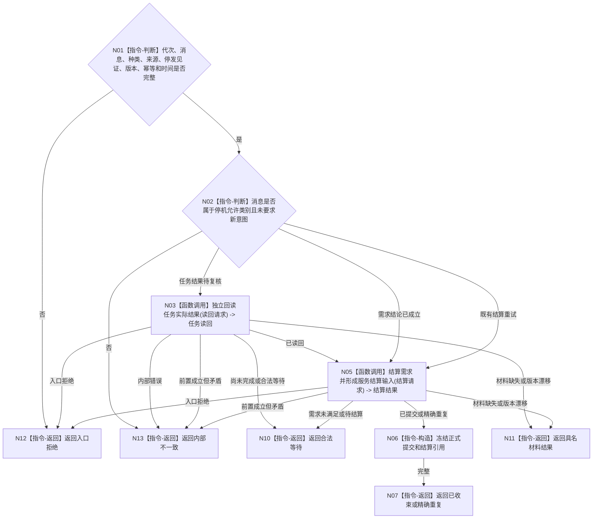

# BIZ-L4-001-14-02-02 按正式合同收束一条最终治理消息目标函数流程图 v0.1

更新时间：2026-08-03

## 依据

```text
0050、6160、6170、8100；BIZ-L3-001-14-02；BIZ-L2-004-06
```

## 身份与边界

正式目标函数设计图。按消息冻结种类只完成已成立任务结果、需求复核或已允许结算，不启动新治理批次、不生成新需求或任务。

## 函数合同

```text
根函数：按正式合同收束一条最终治理消息
归属模块 / 文件 / 层级：自我停机收束 / 海中鱼巣/领域/组合.自我停机收束.ixx / L4
现有或待新增：待新增；复用任务结果读回和BIZ-L2-004-06唯一需求结算组合
完整签名：最终治理消息收束结果 按正式合同收束一条最终治理消息(const 最终治理消息收束请求& 请求)
参数：请求为只读借用；含运行代次、不可变治理消息、消息种类、任务/需求/结算来源引用、停发见证、事实截止版本、幂等身份和当前时间证据；所有借用覆盖调用
返回结果：不可变值式结果；含已收束、精确重复、合法等待、材料缺失、版本漂移、入口拒绝或内部不一致，以及正式提交引用、结算引用或待恢复材料
被调函数流程图：按消息种类复用BIZ-L2-004-05 独立回读任务实际结果、BIZ-L2-004-06 结算需求并形成服务结算输入；不得另造需求复核或结算入口，不得调用完整自我治理循环
父图：BIZ-L3-001-14-02
```

## 流程图



## 节点合同

| 节点 | 类型 | 参数 / 输入绑定 | 结果 / 输出绑定 | 事实读写 | 后继条件 | 验证 |
| --- | --- | --- | --- | --- | --- | --- |
| N02 | 指令-判断 | 冻结消息种类 | 唯一处理分支 | 无 | 停机白名单 | 禁止新需求/任务意图 |
| N03 | 函数调用 | 任务和需求来源 | 正式任务实际结果 | 只读任务实际结果 | 已读回、等待或具名非成功 | 任务完成不等于需求满足 |
| N05/N06 | 函数调用 / 指令 | 已发布任务结果、独立实际结果和需求来源 | 需求结论、结算引用或服务生存聚合输入 | BIZ-L2-004-06 唯一需求结算入口 | 已提交、等待或具名非成功 | 停机不放宽结算准入，不产生第二套需求结算逻辑 |

## 关键边界

服务结算仍遵守预支、完工余款和失败不退款合同；停机本身不产生服务价值，也不允许把未完成需求结算为完成。
