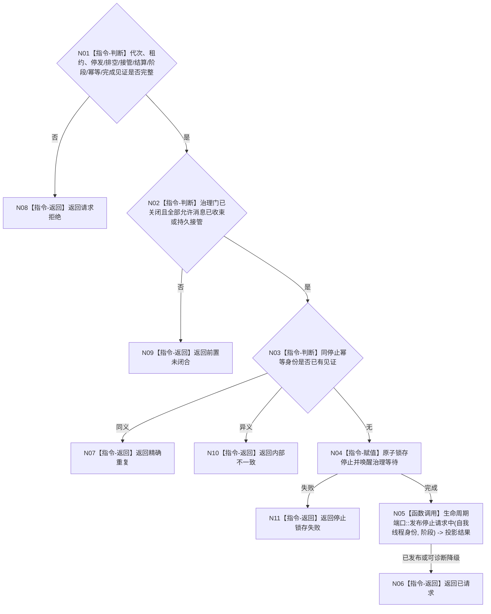

# BIZ-L4-001-14-02-03 请求自我线程停止目标函数流程图 v0.1

更新时间：2026-08-03

## 依据

```text
8100、8110；BIZ-L3-001-14-02
```

## 身份与边界

正式目标函数设计图。仅在允许消息已经收束或持久接管后锁存自我线程停止；不连接线程、不开启新治理循环。

## 函数合同

```text
根函数：请求自我线程停止
归属模块 / 文件 / 层级：自我线程 / 海中鱼巣/线程/自我线程.ixx / L4
现有或待新增：适配扩展；复用停止门，补齐最终排空和结算见证
完整签名：自我线程停止请求结果 请求自我线程停止(const 自我线程停止请求& 请求) noexcept
参数：请求为只读借用；含运行代次、自我线程租约身份、停发见证、最终排空结果、可选剩余材料持久准备见证、已完成结算引用组、停止阶段、幂等身份和完成见证
返回结果：不可变值式结果；含已请求、精确重复、请求拒绝、错代、前置未闭合、停止锁存失败或内部不一致，以及停止见证
被调函数流程图：无；治理门确认关闭、原子停止锁存、等待唤醒和8110旁路发布为本函数内指令
父图：BIZ-L3-001-14-02
```

## 流程图



## 节点合同

| 节点 | 类型 | 参数 / 输入绑定 | 结果 / 输出绑定 | 事实读写 | 后继条件 | 验证 |
| --- | --- | --- | --- | --- | --- | --- |
| N02/N03 | 指令 | 停发、排空和幂等 | 停止资格 | 只读 | 全部允许消息收束 | 未完成结算和重复停止 |
| N04 | 指令 | 停止阶段 | 停止见证 | 只改线程状态 | 原子锁存 | 治理等待唤醒 |
| N05 | 函数调用 | 生命周期材料 | 投影结果 | 只写8110旁路 | 可诊断降级 | 投影失败不撤回停止 |

## 关键边界

请求停止不表示自我进入休眠；休眠由生存控制正式合同裁决。线程停止也不删除自我、需求、任务或安全服务事实。

