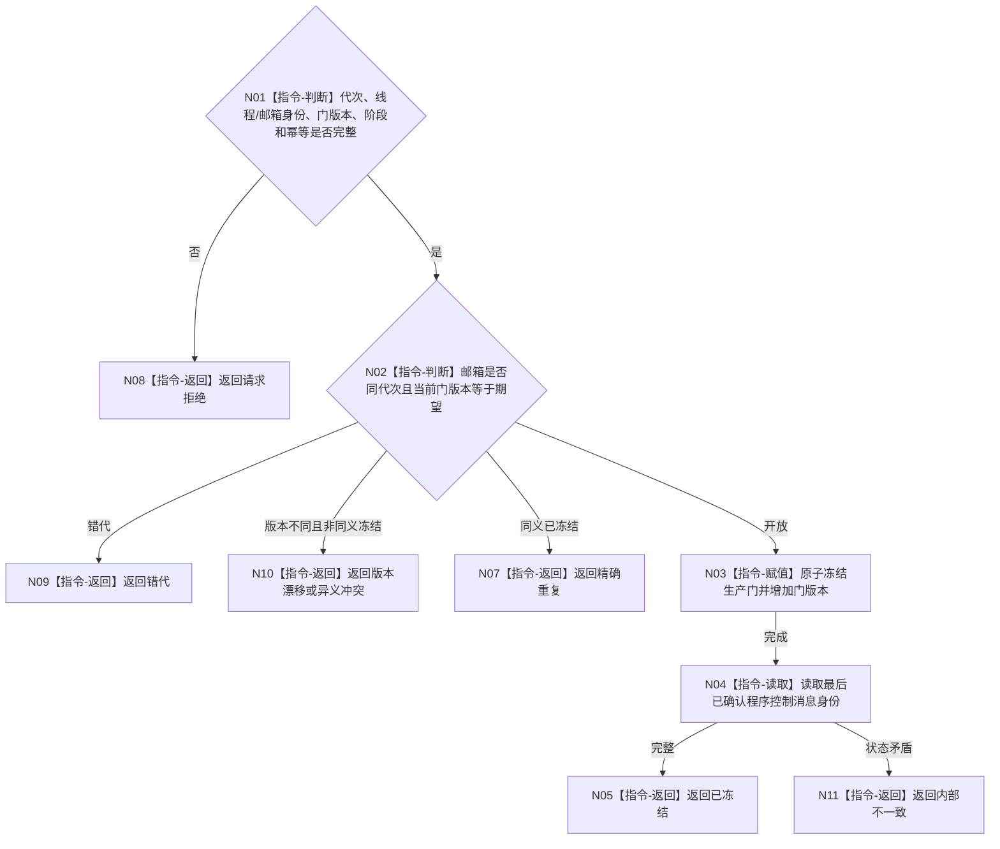

# BIZ-L4-001-14-03-01 冻结控制面板程序控制消息门目标函数流程图 v0.1

更新时间：2026-08-03

## 依据

```text
8110、8120；BIZ-L3-001-14-03；BIZ-L2-005-05
```

## 身份与边界

正式目标函数设计图。原子禁止控制面板线程继续提交新的程序控制消息，同时保留冻结前已确认消息的宿主消费边界；不关闭窗口。

## 函数合同

```text
根函数：冻结控制面板程序控制消息门
归属模块 / 文件 / 层级：程序控制消息 / 海中鱼巣/线程/程序控制邮箱.ixx / L4
现有或待新增：待新增；与程序控制邮箱生产门同所有者
完整签名：程序控制消息门冻结结果 冻结控制面板程序控制消息门(const 程序控制消息门冻结请求& 请求) noexcept
参数：请求为只读借用；含运行代次、控制面板线程租约身份、程序控制邮箱身份、期望门版本、停止阶段和幂等身份；借用覆盖调用
返回结果：不可变值式结果；含已冻结、精确重复、请求拒绝、错代、版本漂移、异义冲突或内部不一致，以及新门版本和最后已确认消息身份
被调函数流程图：无；原子门版本比较、冻结和截止见证发布为本函数内指令
父图：BIZ-L3-001-14-03
```

## 流程图



## 节点合同

| 节点 | 类型 | 参数 / 输入绑定 | 结果 / 输出绑定 | 事实读写 | 后继条件 | 验证 |
| --- | --- | --- | --- | --- | --- | --- |
| N02/N03 | 指令 | 门版本和幂等 | 新门版本 | 只改程序控制邮箱生产门 | 版本匹配 | 并发提交和重复冻结 |
| N04 | 指令 | 冻结后邮箱 | 消息截止身份 | 只读 | 截止完整 | 冻结前最后消息守恒 |

## 关键边界

消息门冻结不删除冻结前已确认停止消息，也不禁止线程生命周期旁路消息；两类通道必须分离。
