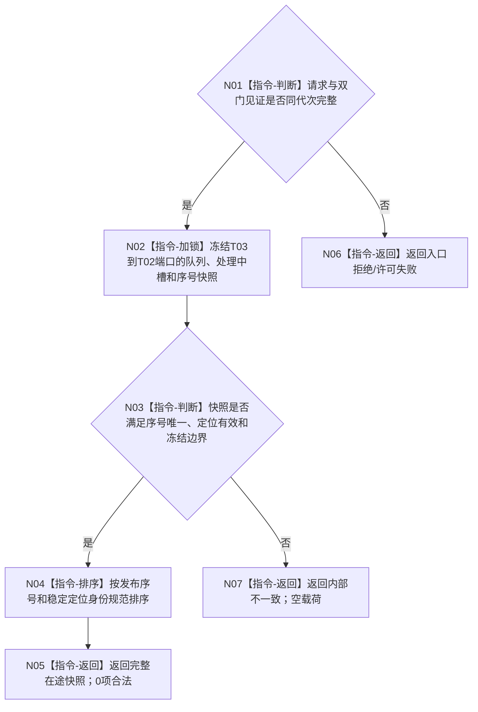

# BIZ-L4-001-14-03-01 读取任务管理到自我的在途结算定位目标函数流程图 v0.1

更新时间：2026-08-26

## 依据

```text
0050、8100 v0.8；BIZ-L3-001-14-03
```

## 身份与边界

正式目标函数设计图。按冻结见证读取 T03 已接受但尚未由 T02 完成消费的任务轮次结算定位，以及 T03 正在形成/发布该定位的单一处理中槽；只返回稳定定位和进度，不读取任务结果缓存或推断需求满足。

## 函数合同

```text
根函数：读取任务管理到自我的在途结算定位
归属模块 / 文件 / 目标分解深度：任务管理上行端口 / 海中鱼巣/线程/上行桥.任务实际结果.ixx / BIZ-L4
现有或待新增：待新增只读收口入口
完整签名：任务结算定位在途读取结果 读取任务管理到自我的在途结算定位(const 任务结算定位在途读取请求& 请求) const noexcept
参数：请求含运行代次、T03/T02身份、双门冻结见证、最后允许序号和读取幂等身份
返回结果：不可变值式结果；含规范有序已接受定位组、可选处理中槽、发布/消费序号、读取截止、空、许可/资源/内部失败
被调函数流程图：无；端口快照和规范排序为本函数内指令
父图：BIZ-L3-001-14-03
```

## 流程图



## 关键边界

队列为空但处理中槽非空不是共同空槽；读取结果必须同时承载两者。
