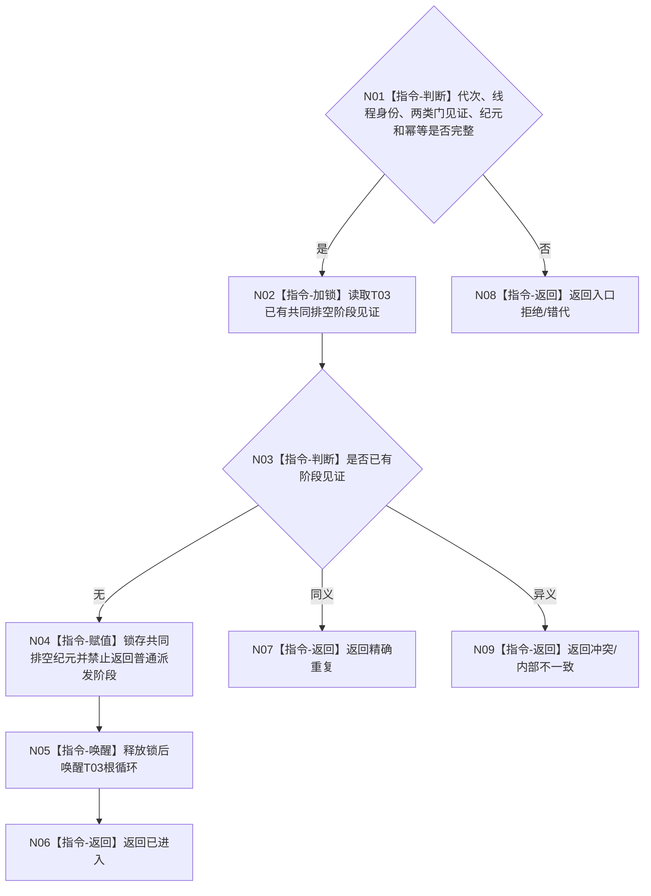

# BIZ-L4-001-14-03-01 通知任务管理线程进入治理共同排空阶段目标函数流程图 v0.1

更新时间：2026-08-27

## 依据

```text
0050、8100、8110；BIZ-L3-001-14-03、BIZ-L1-T03 v0.5
```

## 身份与边界

正式目标函数设计图。在 T03 控制域锁存共同排空纪元并唤醒任务管理根循环。根循环继续处理冻结边界内已接受的管理输入、主阶段治理槽、工作结果定位、未完成工作槽和待提交 self 材料；本函数不读取或处理这些业务正文。

## 函数合同

```text
根函数：通知任务管理线程进入治理共同排空阶段
归属模块 / 文件 / 目标分解深度：任务管理线程控制域 / 海中鱼巣/线程/任务管理线程.ixx / BIZ-L4
现有或待新增：待新增
完整签名：任务管理共同排空阶段结果 通知任务管理线程进入治理共同排空阶段(const 任务管理共同排空阶段请求& 请求) noexcept
参数：请求含运行代次、任务管理线程身份、普通输入门与001-12派发边界见证、共同排空纪元和幂等身份
返回结果：不可变值式结果；含已进入、精确重复、入口拒绝、错代、幂等冲突或内部不一致，以及阶段见证
被调函数流程图：无；控制域加锁、锁存和唤醒均为本函数内指令
父图：BIZ-L3-001-14-03
```

## 流程图



## 关键边界

进入共同排空不是停止线程，也不是业务完成。T03 仍只能在自己的根循环、锁外调用正式领域入口；外部协调器不得替它消费任何槽。
