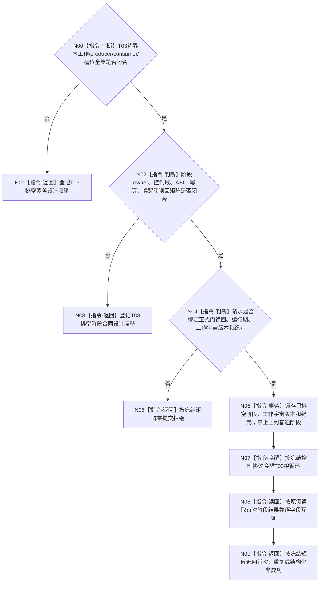

# BIZ-L4-001-14-03-01 通知任务管理线程进入治理共同排空阶段目标函数流程图 v0.2

更新时间：2026-08-28

## 依据

```text
0050、8100 v0.7、8110 v0.3；BIZ-L3-001-14-03 v0.2、BIZ-L3-001-14-01 v0.2；
BIZ-L1-T03 v0.5；HEAD任务管理线程代码。
```

## 身份与边界

正式目标治理图。本叶目标是在T03普通输入与001-12未来正式派发边界均关闭后，使任务管理根循环进入只完成冻结边界内工作及其必需交付的排空阶段。它只改变线程控制态并唤醒根循环，不读取、移动或处理业务正文。

旧v0.1提前冻结了运行代次、线程身份、两类门见证、共同纪元、幂等和阶段见证。HEAD没有统一T03排空控制域；结果上行、重筹办和强类型请求分布在不同锁与处理路径。正式材料也未冻结T03边界内完整工作宇宙、哪些producer可在排空期继续交付、阶段owner、回退禁止、幂等账和正式读回。

## 函数合同

```text
根函数候选：通知任务管理线程进入治理共同排空阶段
归属模块 / 文件 / 目标分解深度：任务管理线程排空控制 / 物理文件待参与者owner裁决 / BIZ-L4
现有或待新增：HEAD无本阶段入口或参与者
完整签名：未冻结；旧任务管理共同排空阶段请求/结果不构成ABI
参数：未冻结；必须绑定T03运行期、正式输入/派发门读回、封闭工作宇宙版本、共同排空纪元和本阶段幂等身份
返回结果：未冻结；必须含首次进入、精确重复、入口拒绝、版本/当前性漂移、幂等冲突、资源失败、内部错误、已可能提交和正式读回
被调函数流程图：无；合同闭合后由T03参与者owner锁存阶段并唤醒根循环
父图：BIZ-L3-001-14-03 v0.2
```

## 设计门禁与目标骨架



## 节点合同

| 节点 | 当前可确认合同 | 仍待冻结 | 验证边界 |
| --- | --- | --- | --- |
| N00/N01 | 排空期允许工作必须覆盖门前已接受输入及其完成交付 | T03输入/槽/producer/consumer/通道全集与版本 | 结果回执、重筹办、工作结果定位、待交self材料和未知入口 |
| N02/N03 | 线程owner只锁存控制阶段；根循环锁外继续调用正式领域入口 | owner、锁/唤醒、请求/结果、幂等、读回和恢复 | 首次、重复、唤醒失败、线程终止与提交后读回失败 |
| N04/N05 | 两类正式门和工作宇宙版本须逐字段互证；目标图不是见证 | 门结果形状、运行期、纪元和同义公式 | 坏门、错代、版本漂移和同键异义 |
| N06—N09 | 进入排空不等于局部静止或业务完成；不得清槽 | 不可逆阶段语义、首次结果存放和成功公式 | 并发最后输入、既有处理、资源/内部错误 |

## 当前代码对应（HEAD `7883bf24`）

- T03只有局部停止锁存和最终结果上行排空；没有允许边界内producer继续交付的独立只排空阶段。
- 多类输入、待处理队列和处理槽分布在不同锁下，没有工作宇宙版本或阶段正式读回。

## 具名偏差

1. `DRIFT-BIZ-T03-T02-GOVERNANCE-DRAIN-CLOSED-WORK-UNIVERSE-CHANNELS-SLOTS-AND-PRODUCER-CONSUMER-BIJECTION-UNFROZEN`
2. `DRIFT-BIZ-T03-GOVERNANCE-DRAIN-STAGE-OWNER-ABI-IDEMPOTENCY-AND-READBACK-MATRIX-UNFROZEN`

## v0.2校正记录

- 撤销旧v0.1的具体签名、共同纪元字段、阶段见证和完整状态矩阵。
- 明确局部停发和最终排空不能替代允许边界内交付的独立排空阶段。
- 保留线程根循环自行处理业务、外部只锁存控制阶段和唤醒的职责边界。
