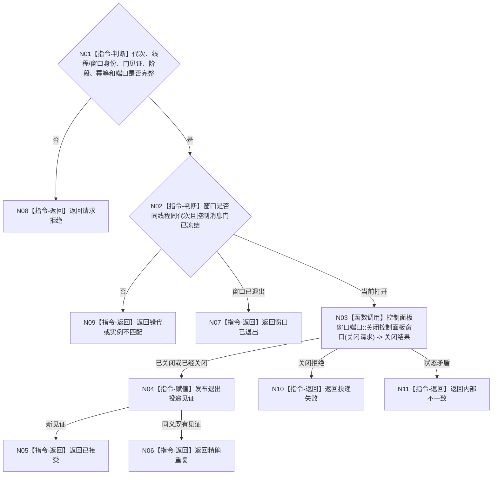

# BIZ-L4-001-14-03-02 向当前窗口投递退出请求目标函数流程图 v0.1

更新时间：2026-08-03

## 依据

```text
8110、8120；BIZ-L3-001-14-03；BIZ-L2-005-06
```

## 身份与边界

正式目标函数设计图。在线程亲和边界内向当前控制面板窗口实例投递退出请求；不等待线程连接、不影响其它业务线程。

## 函数合同

```text
根函数：向当前窗口投递退出请求
归属模块 / 文件 / 层级：控制面板线程 / 海中鱼巣/线程/控制面板线程.ixx / L4
现有或待新增：待新增；复用窗口关闭端口，增加当前窗口身份、阶段和幂等投递
完整签名：控制面板窗口退出投递结果 向当前窗口投递退出请求(const 控制面板窗口退出投递请求& 请求) noexcept
参数：请求为只读借用；含运行代次、控制面板线程租约身份、当前窗口实例身份、控制消息门冻结见证、停止阶段、退出幂等身份和窗口端口；租约覆盖投递
返回结果：不可变值式结果；含已接受、精确重复、窗口已退出、请求拒绝、错代、实例不匹配、投递失败或内部不一致，以及退出投递见证
被调函数流程图：BIZ-L2-005-06 控制面板窗口端口::关闭控制面板窗口
父图：BIZ-L3-001-14-03
```

## 流程图



## 节点合同

| 节点 | 类型 | 参数 / 输入绑定 | 结果 / 输出绑定 | 事实读写 | 后继条件 | 验证 |
| --- | --- | --- | --- | --- | --- | --- |
| N02 | 指令 | 窗口和门见证 | 投递资格 | 只读UI状态 | 门已冻结 | 窗口替换和重复退出 |
| N03/N04 | 函数调用 / 指令 | 当前窗口关闭请求 | 投递结果 | 只操作UI资源 | 已接受或具名非成功 | 线程亲和和窗口已关闭 |

## 关键边界

退出投递见证只证明窗口关闭请求被当前窗口端口接受，不证明消息循环已经退出；后者由连接前的完成见证复核。

