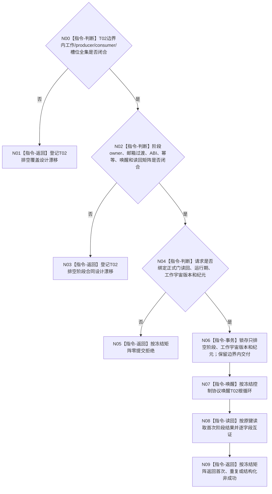

# BIZ-L4-001-14-03-02 通知自我线程进入治理共同排空阶段目标函数流程图 v0.2

更新时间：2026-08-28

## 依据

```text
0050、8100 v0.7、8110 v0.3；BIZ-L3-001-14-03 v0.2、BIZ-L3-001-14-01 v0.2；
BIZ-L1-T02 v0.6；HEAD自我治理邮箱与根循环代码。
```

## 身份与边界

正式目标治理图。本叶目标是在T02新普通治理输入与001-12未来新D意图生产边界均关闭后，使自我治理根循环进入只完成冻结边界内批次、私有处理槽及必需下行交付的排空阶段。它不停止整个邮箱、不丢弃处理槽，也不代替根循环调用业务provider。

旧v0.1提前冻结了运行代次、线程身份、两类门见证、共同纪元、幂等和阶段见证。HEAD只有邮箱整体停止、批次冻结和线程私有处理槽；正式材料没有冻结T02排空期工作/producer/consumer全集、阶段owner、邮箱准入过渡、幂等账、正式读回或永久provider失败时的终止合同。

## 函数合同

```text
根函数候选：通知自我线程进入治理共同排空阶段
归属模块 / 文件 / 目标分解深度：自我线程排空控制 / 物理文件待参与者owner裁决 / BIZ-L4
现有或待新增：HEAD无本阶段入口或参与者
完整签名：未冻结；旧自我治理共同排空阶段请求/结果不构成ABI
参数：未冻结；必须绑定T02运行期、正式输入/新D意图门读回、封闭工作宇宙版本、共同排空纪元和本阶段幂等身份
返回结果：未冻结；必须含首次进入、精确重复、入口拒绝、版本/当前性漂移、幂等冲突、资源失败、内部错误、已可能提交和正式读回
被调函数流程图：无；合同闭合后由T02参与者owner锁存阶段并唤醒根循环
父图：BIZ-L3-001-14-03 v0.2
```

## 设计门禁与目标骨架



## 节点合同

| 节点 | 当前可确认合同 | 仍待冻结 | 验证边界 |
| --- | --- | --- | --- |
| N00/N01 | 排空期允许工作必须覆盖门前批次及其合法后继/下行交付 | T02消息/批次/槽/producer/consumer/通道全集与版本 | 结算定位、self后继、D意图停产结果、授权、私有槽重试 |
| N02/N03 | 整体邮箱停止不能替代只排空阶段；线程owner保留原槽 | owner、邮箱过渡、锁/唤醒、ABI、幂等、读回和恢复 | 停止混批、门前晚到、邮箱停止竞态和提交后读回失败 |
| N04/N05 | 两类正式门和工作宇宙版本须逐字段互证；不得从消息数量猜边界 | 门结果、运行期、纪元和同义公式 | 坏门、错代、版本漂移和同键异义 |
| N06—N09 | 进入排空不等于局部静止；永久provider失败保持槽与租约 | 不可逆阶段、首次结果、永久失败和成功公式 | 既有批次、合法等待、资源/内部错误和线程故障 |

## 当前代码对应（HEAD `7883bf24`）

- T02根循环有邮箱冻结批次和私有处理槽，但停止路径仍可能在槽未闭合时退出；没有独立排空阶段。
- HEAD没有工作宇宙版本、排空纪元、阶段幂等账或正式读回；邮箱整体停止会拒绝后续必要交付。

## 具名偏差

1. `DRIFT-BIZ-T03-T02-GOVERNANCE-DRAIN-CLOSED-WORK-UNIVERSE-CHANNELS-SLOTS-AND-PRODUCER-CONSUMER-BIJECTION-UNFROZEN`
2. `DRIFT-BIZ-T02-GOVERNANCE-DRAIN-STAGE-OWNER-ABI-IDEMPOTENCY-AND-READBACK-MATRIX-UNFROZEN`
3. `DRIFT-BIZ-L1-T02-STOP-WITH-PERMANENT-PROVIDER-FAILURE-UNFROZEN`

## v0.2校正记录

- 撤销旧v0.1的具体签名、共同纪元字段、阶段见证和完整状态矩阵。
- 区分只排空阶段与邮箱整体停止；边界内批次、私有槽和必需交付必须守恒。
- 保留永久provider失败时不丢槽、不假成功、不建立第二业务owner的边界。
